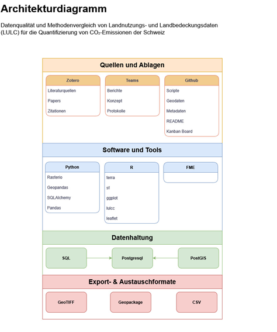

# Aufbau der Arbeit

---

## Architektur 
Das in Abbildung 2 dargestellte Architekturdiagramm beschreibt die grundlegende Struktur der verwendeten Komponenten und deren funktionalen Beziehungen. Es unterscheidet zwischen Quellen und Ablagen, Software- und Analysewerkzeugen sowie der zentralen Datenhaltung.
Papers, Konzepte und Protokolle werden über Zotero und Microsoft Teams organisiert, wodurch Literaturquellen, Berichte und Projektergebnisse systematisch verwaltet werden können. Technische Ressourcen wie Skripte, Geodaten, Metadaten und die Projektkoordination werden auf GitHub verwaltet. Die Datenhaltung erfolgt in einer PostgreSQL/PostGIS-Datenbank, die als zentrale Plattform zur Speicherung und Verwaltung der Daten dient. Für den Datenaustausch werden standardisierte Formate wie GeoTIFF, CSV und GeoPackage verwendet. Dadurch sind Interoperabilität und Wiederverwendbarkeit sichergestellt. Es werden Python- und R-basierte Werkzeuge eingesetzt. In Python werden vor allem Geopandas, Rasterio, SQLAlchemy und Pandas zur Datenverarbeitung, Transformation und Datenbankanbindung eingesetzt. In R werden Pakete wie terra, sf, ggplot und lulcc für räumliche Analysen, Klassifikationen und Visualisierungen verwendet. FME dient optional als ergänzendes Werkzeug für Datenextraktion, -transformation und -ladung. Die Architektur ermöglicht dadurch eine klare Trennung zwischen Datenhaltung, Analyse und Dokumentation und unterstützt eine reproduzierbare, transparente Forschungspraxis.

  

**Abbildung 1**: Architekturdiagramm für das gesamte Projekt

[↑](#top)

  

    <a href="index.html">← Aufbau</a>
  

  

    <a href="02_literaturrecherche.html">Literaturrecherche →</a>
  

