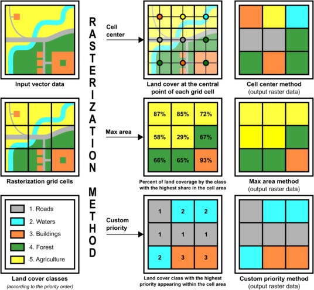
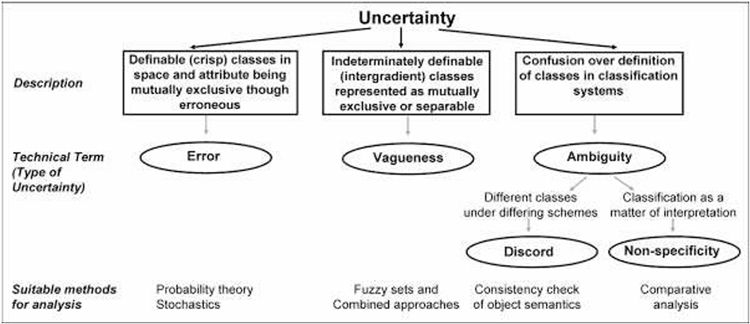
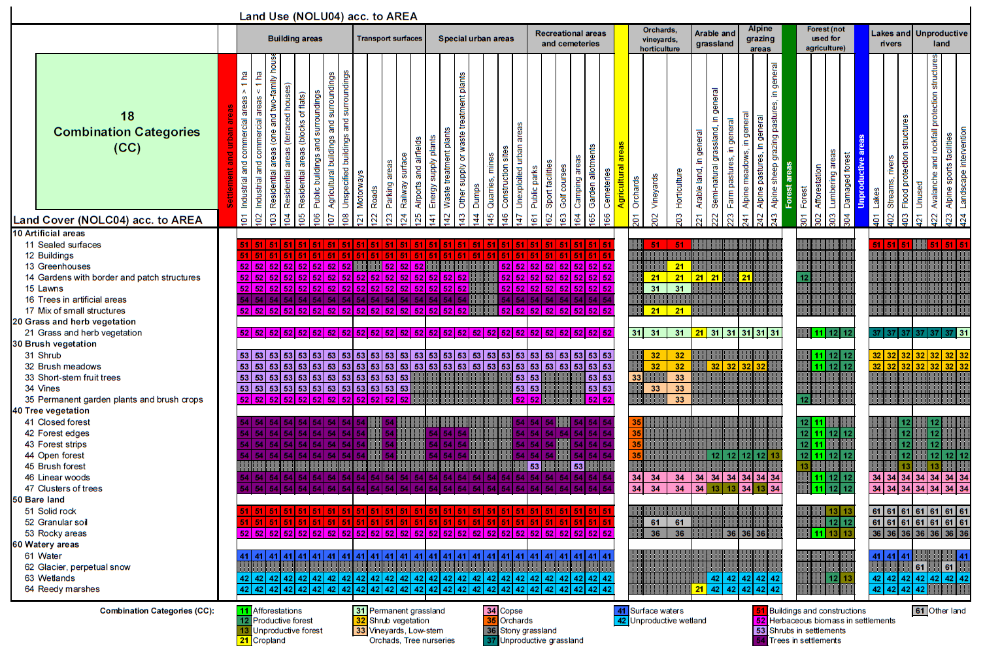
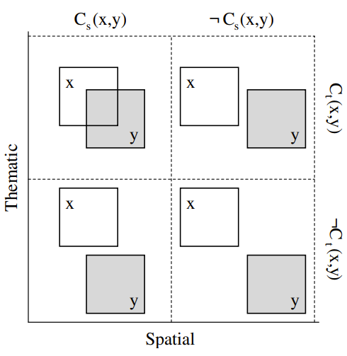
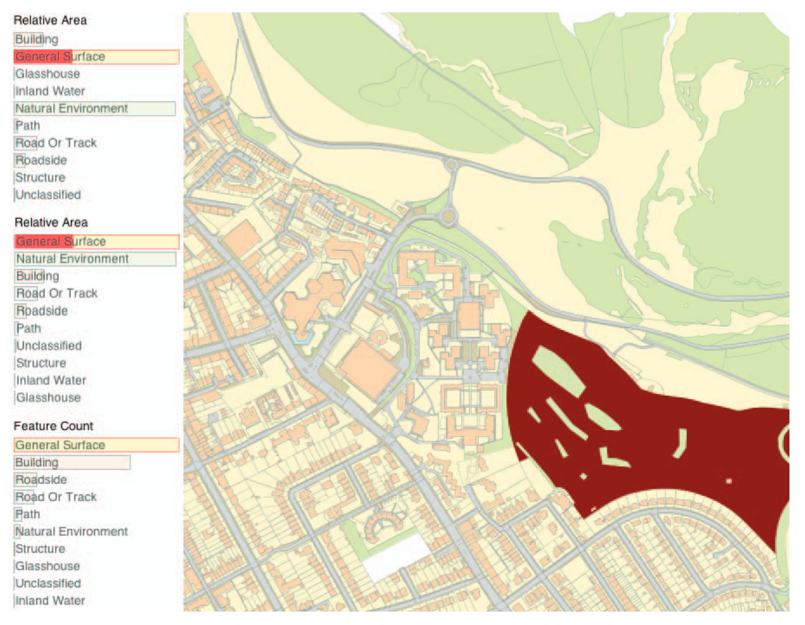
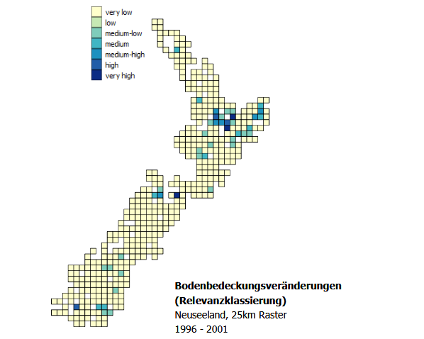
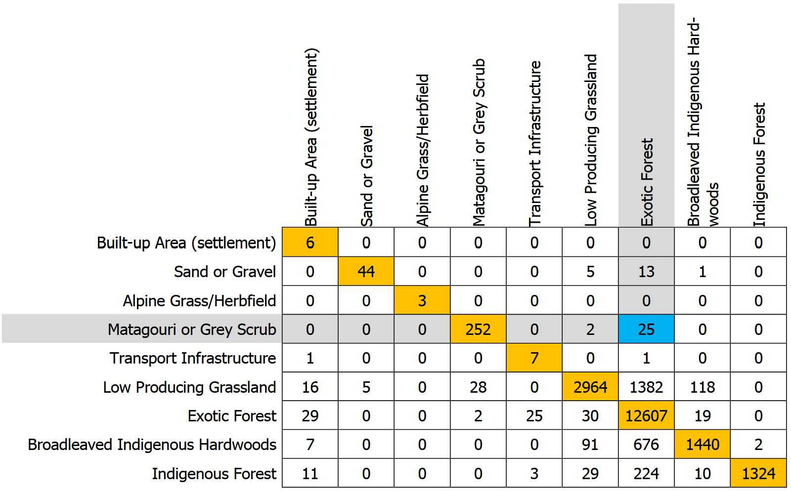
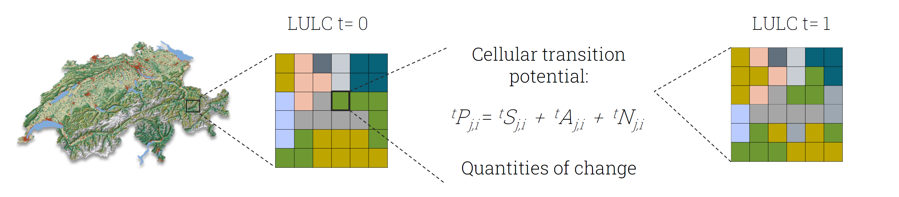

# Literaturrecherche

Diese Literaturrecherche befasst sich mit der Erfassung, Vergleichbarkeit und Harmonisierung von Landnutzungs- und Landbedeckungsdaten (LULC). Untersucht wird, wie sich verschiedene nationale, europäische und globale Datensätze in Auflösung, Klassifikation und Genauigkeit in der Schweiz unterscheiden und wie sie auf das IPCC-Kategoriensystem abgebildet werden können. Zudem werden Unsicherheiten, Harmonisierungsmethoden und geeignete Verfahren zur Analyse und Visualisierung von LULC-Veränderungen betrachtet.

## Begriffserklärung Landbedeckung und Landnutzung

Der Begriff Land Use beschreibt menschliche Aktivitäten auf einer Fläche, also die Art und Weise, wie Menschen das Land nutzen (z. B. für Land- oder Forstwirtschaft). Clawson und Stewart definieren Land Use als menschliche Aktivität, welche direkt mit dem Landboden verbunden ist (Anderson et al., 1976, p. 4). Diese Nutzung ist dynamisch und verändert sich infolge ökonomischer, sozialer und ökologischer Prozesse. Land Use ist somit ein funktionaler Begriff, der eng mit Ökosystemen und menschlichen Eingriffen verbunden ist.

Demgegenüber bezeichnet Land Cover die physische Bedeckung der Erdoberfläche. Land Cover wird als Vegetation und künstliche Konstruktionen beschrieben, welche den Boden bedecken (Burley, 1961). Diese Definition betont die Beobachtbarkeit des Landzustands, unabhängig von seiner Nutzung. Das Land Cover bildet die Grundlage für viele Fernerkundungsanwendungen, da es visuell und spektral messbar ist (Anderson et al., 1976, pp. 4--5). Brown et al. (2025) erweitern dieses Konzept, indem sie in ihrem Land Cover Classification System (LCCS) die Integration\
der Landnutzungs- und der Landbedeckungsebene als zentrales Merkmal moderner Erdbeobachtungsmodelle hervorheben. Ihr Model kombiniert satellitenbasierte Daten mit Kontextinformationen, um sowohl Land Cover als auch Land Use simultan zu klassifizieren.

Während Land Cover häufig als objektiv erfassbare physische Bedeckung der Erdoberfläche verstanden wird, weisen Comber et al. (2005, pp. 1--3, 9--10) darauf hin, dass es sich dabei um eine konzeptuelle Kategorie handelt. Diese entsteht im Zuge von Klassifikations- und Entscheidungsprozessen, bei denen technische, institutionelle und gesellschaftliche Faktoren miteinander verflochten werden. Ob eine Fläche als Wald oder Siedlung bezeichnet wird, hängt folglich nicht allein von Beobachtungen ab, sondern auch von den zugrunde gelegten Definitionen. Comber et al. (2005, pp. 5--6) beziehen sich in diesem Zusammenhang auf Arbeiten von Rosch (1978) sowie Smith und Mark (2001). Die Arbeiten zeigen, dass Kategorien keine naturgegebenen Entitäten darstellen, sondern das Ergebnis menschlicher Konzeptbildung sind. Aus dieser Perspektive erscheint Land Cover weniger als objektiv messbare Eigenschaft, sondern vielmehr als interpretatives System, das physische Charakteristika in sozial geteilte Bedeutungsräume übersetzt.

## Unterschied zwischen Land Use und Land Cover

Obwohl Land Use und Land Cover oft gemeinsam analysiert werden, unterscheiden sie sich wesentlich in Perspektive und Datenerhebung. Land Cover ist primär eine Beobachtungsebene physischer Merkmale, während Land Use die funktionalen Entscheidungen menschlicher Akteure widerspiegelt (Anderson et al., 1976, p. 4). Laut dem IPCC (2003, p. 2.8-2.10) kann eine Fläche mit der Landbedeckung Wald verschiedene Nutzungen haben. Dazu gehören z.B. Produktionswald, Schutzgebiet oder Freizeitlandschaft.

Das Intergovernmental Panel on Climate Change (IPCC) (2003, p. 2.8-2.18) betont die Notwendigkeit einer klaren Abgrenzung beider Begriffe in der Klimaberichterstattung, um Doppelzählungen und Inkonsistenzen zu vermeiden. In der «Good practice guidance for land use, land-use change and forestry» wird hervorgehoben, dass Land Cover Daten für die physische Bestimmung von Flächen notwendig ist, während Land Use Kategorien ihre funktionale Bedeutung für Emissionen und Kohlenstoffdynamiken liefern.

Ferner betont das IPCC, dass ein konsistentes Klassifikationssystem sicherstellen muss, dass jede Flächeneinheit eindeutig einer Kategorie zugeordnet wird, auch wenn Mischformen (etwa landwirtschaftlich genutzte Wälder) existieren (IPCC, 2003, p. 2.9-2.14). Die Harmonisierung dieser Systeme ermöglicht eine präzisere Nachverfolgung von Landnutzungsänderungen über Zeitreihen und verbessert die globale Berichterstattung über Emissionen und Senken.

Moderne Ansätze zeigen, dass fortschrittliche KI-Modelle durch semantische Einbettungen und multimodale Datenanalyse fähig sind, Land Cover und Land Use in einer skalierbaren Klassifikationsarchitektur zu vereinen (Brown et al., 2025, pp. 27 & 33--35). Diese Integration markiert einen methodischen Fortschritt gegenüber früheren beobachtungsbasierten Systemen wie dem von Anderson et al. (1976).

## Datenqualität und Unsicherheiten in LULC-Änderungen

Um Änderungen in Bodennutzung und Bodenbedeckung, welche für die Treibhausgasinventur relevant sind, zu detektieren, sollen die entsprechenden Daten vier zentrale Eigenschaften aufweisen, welche in den IPCC-Richtlinien beschrieben sind (IPCC, 2003, p. 25):

-   **Angemessenheit:** Sie müssen in der Lage sein, Veränderungen der Kohlenstoffvorräte sowie Emissionen und Entnahmen von Treibhausgasen realistisch darzustellen und deren Zusammenhang mit Landnutzung und Landänderung abzubilden.

-   **Konsistenz:** Sie sollen Landnutzung und Bewirtschaftung über längere Zeiträume hinweg einheitlich erfassen, ohne dass künstliche Brüche in den Datenreihen oder Verzerrungen durch wiederkehrende Nutzungsmuster entstehen.

-   **Vollständigkeit:** Das gesamte Landesgebiet sollte berücksichtigt werden, sodass Flächenzunahmen in einer Kategorie durch entsprechende Abnahmen in einer anderen ausgeglichen werden.

-   **Transparenz:** Alle verwendeten Datenquellen, Definitionen, Methoden und Annahmen müssen klar beschrieben und nachvollziehbar dokumentiert sein.

### Harmonisierung der Daten

Die Datenharmonisierung ist ein wichtiger Prozess, um unterschiedliche Datensätze vergleichbar und kombinierbar zu machen. Sie sorgt dafür, dass Daten aus verschiedenen Quellen gemeinsam analysiert werden können und dadurch verlässliche Ergebnisse entstehen. Im Gegensatz zur Standardisierung schreibt Harmonisierung keine festen Regeln vor, sondern sucht flexible Wege unterschiedliche Daten sinnvoll zusammenzuführen (Cheng et al., 2024, pp. 2--3). Vor allem für den Vergleich von Bodenbedeckungs- und Bodennutzungsdaten ist es essenziell mit harmonisierten Daten zu arbeiten. Jansen et al. (2008, p. 133) beschreibt, dass die Harmonisierung hier konzeptionelle-, räumliche-, zeitliche-, semantische und Qualitätsaspekte umfassten soll.

### Rasterisierung von Landesbedeckungsdaten

Die Rasterisierung von Landbedeckungsdaten ist wichtig, wenn man Vektor mit Rasterdaten vergleichen möchte. In ArcGIS Pro 3.2 und QGIS 3.34 wird standardmässig die «Cell Center Methode» zur Rasterisierung verwendet, bei welcher der Polygonwert des Zellzentrums übernommen wird. Durch die Anwendung dieses Verfahrens können schmale lineare Strukturen, wie 10m breite Strassen, im 100m-Raster nicht erfasst werden, was die räumliche Kontinuität zerstört (Kubacka & Piniarski, 2024, p. 6). Alternativ gibt es die «Max Area» Rasterisierung, bei der die Fläche innerhalb einer Zelle mit der grössten Ausdehnung übernommen wird. Bei aggregierten Landbedeckungsdaten führt dies jedoch zu ähnlichen Problemen wie die «Cell Center» Methode. Beide Methoden sind auf der Folgeseite in Abbildung 2 schematisch illustriert.

  

Abbildung 2: Vergleich von Methoden zur Rasterisierung von Landbedeckungsdaten (vgl. Kubacka & Piniarski, 2024, Figure 2)

Kubacka & Piniarski (2024, p. 6) beschreiben ebenfalls, dass zur besseren Erhaltung linearer Strukturen die «Custom-Priority» Methode entwickelt wurde, welche die nachfolgenden Landbedeckungsklassen in der nachfolgenden Reihenfolge priorisiert.

1\. Verkehr 4. andere künstliche Flächen

2\. Gewässer 5. Wald- und seminaturähnliche Flächen

3\. Siedlung 6. Landwirtschaft.

### Interpolation von Raster zu Punkt

Die «Weighted Neighbourhood Methode» ist ein lokales, regelbasiertes Verfahren zur Zuordnung von Rasterwerten zu Punktpositionen (Mitas & Mitasova, 1999). Sie basiert auf der Annahme, dass benachbarte Rasterzellen einen Einfluss auf den Wert eines Punktes haben, wobei nahe Zellen stärker gewichtet werden als weiter entfernte. Für jeden Punkt wird eine Nachbarschaft definiert, die alle Rasterzellen innerhalb eines festgelegten Radius umfasst. Jede Zelle erhält ein Gewicht, das typischerweise invers proportional zur Entfernung oder über einen Gauss-Kernel bestimmt wird (Mitas & Mitasova, 1999). Für kontinuierliche Variablen wird der Punktwert als gewichtetes Mittel der Nachbarzellen berechnet. Bei kategorialen Daten, wie Landnutzungsklassen, erfolgt die Zuordnung anhand der gewichteten Mehrheitsklasse, sodass die Klasse mit der höchsten gewichteten Summe der Nachbarzellen dem Punkt zugewiesen wird (Mitas & Mitasova, 1999). Diese Methode reduziert Artefakte an Rasterzellenrändern, berücksichtigt lokale räumliche Strukturen und ist flexibel, da Parameter wie Suchradius, Distanzgewichtung oder Kernelbreite an die Daten angepasst werden können. Sie eignet sich insbesondere für den Vergleich von Punktdaten mit Rasterinformationen. Laut Mitas und Mitasova (1999) erlaubt die «Weighted Neighbourhood Methode» eine reproduzierbare und realistische Darstellung der räumlichen Variabilität, während lokale Strukturen erhalten bleiben.

### Hochskalieren von Rasterdaten

Markham et al. (2023, pp. 620--625) beschreibt, dass beim Hochskalieren von Rasterdaten die Pixelgrösse vergrössert wird, wodurch die Auflösung abnimmt. Dabei werden mehrere kleine Einheiten zu einer grösseren zusammengefasst, wobei angenommen wird, dass eine aggregierte Eigenschaft, wie etwa ein Mittelwert, existiert. Eine gängige Methode ist die Mehrheitsregel Die neue Zelle übernimmt die Kategorie, die in den feinen Pixeln am häufigsten vorkommt. Dadurch können aber seltene Klassen verschwinden und die Landschaft wirkt oft zu homogen.

Alternativ wählt die zufallsbasierte Methode eine Kategorie zufällig aus den feinen Pixeln. So bleiben die Klassenanteile erhalten, jedoch entstehen eher unruhige Muster.

Die Punktverteilungsfunktion berücksichtigt die umliegenden Pixel mit unterschiedlichen Gewichtungen, um nachzubilden, wie ein Sensor die Landschaft erfasst. Dadurch entstehen realistischere Muster.

Die distanzgewichtete Methode arbeitet mit einem gewichteten Raster um den Mittelpunkt der neuen Zelle. Sie berücksichtigt sowohl die relative Häufigkeit der Klassen als auch die räumliche Struktur, sodass die Aggregation genauer ist und Klassenanteile sowie Muster besser erhalten bleiben.

### Herunterskalieren von Rasterdaten

Ebenfalls beschreibt Markham et al. (Markham et al., 2023, pp. 620--625), dass beim statistischen Herunterskalieren geschaut wird, wie grobe Landbedeckungsdaten mit feineren Umweltfaktoren wie Klima, Geländeform oder menschlicher Nutzung zusammenhängen. Mit Rechenmodellen kann man daraus genauere Karten ableiten. Eine andere Möglichkeit ist, nicht die Landbedeckung selbst, sondern Kennzahlen der Landschaft (z.B. wie zerschnitten oder vielfältig sie ist) zu verkleinern. Diese Kennzahlen folgen oft bestimmten Musterregeln über verschiedene Massstäbe hinweg. Insgesamt liegt das Problem darin, dass beim Vergröbern der Daten, Fehler und Verzerrungen entstehen.

## Thematische Harmonisierung

Die thematische Harmonisierung ist der Prozess der systematischen Angleichung unterschiedlicher Klassifikationssysteme für Landnutzung und Landbedeckung, damit Daten unterschiedlicher Herkunft vergleichbar, konsistent und berichtsfähig nach den Standards des IPCC (2003) werden. Die Standards geben hierfür keine einzelne algorithmische Lösung vor, sondern ein methodisches Rahmenwerk, das auf Transparenz, Nachvollziehbarkeit und Konsistenz der angewandten Klassifikationslogik beruht. Das Ziel besteht darin, die Landnutzungsinformationen aus unterschiedlichen Quellen auf ein gemeinsames, standardisiertes Kategoriensystem abzubilden, um eine konsistente Darstellung zu gewährleisten. (Cheng et al., 2024, pp. 2--3)

### Allgemeines Vorgehen nach IPCC

Im Report der IPCC (2003, pp. 25--36) wird ein allgemeines Vorgehen zur Harmonisierung beschrieben, das folgende Schritte umfasst:

1\. Ausgangsanalyse der Quellsysteme

Zu Beginn der Harmonisierung werden die vorhandenen Datensätze und ihre Klassifikationssysteme systematisch analysiert. Dabei werden die Legenden, Klassendefinitionen, Hierarchieebenen, räumliche Abdeckung und zeitliche Referenzen der jeweiligen Datenquellen erfasst. Diese Ausgangsanalyse bildet die Grundlage für die spätere Zuordnung und dient zugleich als Dokumentation der Quellen. Es entsteht ein Metadatenblatt zu den Daten, in dem alle relevanten Informationen zu den Quellsystemen festgehalten werden.

2\. Wahl des Zielklassenschemas

Im nächsten Schritt wird das Zielklassensystem definiert. Der IPCC (2003) empfiehlt als minimalen Standard die sechs Hauptkategorien: Forest Land, Cropland, Grassland, Wetlands, Settlements und Other Land. Abhängig vom Zweck der Analyse und der Datenqualität kann entschieden werden, ob Unterklassen z.B. zur etwa die Differenzierung von Waldtypen sinnvoll sind.

3\. Erstellung der Mapping-Tabelle

Die Zuordnung der Quellklassen zu den Zielkategorien erfolgt über eine sogenannte Mapping-Tabelle. Jede Quellklasse erhält dabei eine eindeutige oder, falls notwendig, mehrere Zielklassen-Zuweisungen, die durch Regeln oder Schwellenwerte gesteuert werden. Bei Mehrdeutigkeiten, wie sie beispielsweise in Übergangs- oder Mischklassen auftreten, werden Prioritätsregeln oder zusätzliche Attribute verwendet. Darüber hinaus werden Quelle, Regeltext, Begründung und die geschätzte Unsicherheit der Zuordnung dokumentiert. Es resultiert eine tabellarische, maschinenlesbare Tabelle, die alle Zuordnungsregeln transparent enthält.

4\. Konfliktbehandlung und Regelwerk

In diesem Schritt wird definiert, wie mit Klassen umzugehen ist, die sich nicht eindeutig zuordnen lassen. Dazu zählen etwa Mischlandschaften oder Übergangszonen zwischen zwei Landnutzungstypen. Es wird entschieden, ob solche Klassen aggregiert werden sollen oder ob sie als separate Kategorie (z.B. «mixed» oder «unknown») erhalten bleiben. Ein klar definiertes Regelwerk stellt sicher, dass Zuordnungen konsistent angewendet und nachvollziehbar dokumentiert werden.

5\. Umsetzung der Zuordnung

Nach der Definition der Zuordnungsregeln wird die Harmonisierung praktisch umgesetzt. Dabei werden die Mapping-Regeln auf die Datensätze angewendet, beispielsweise durch Attributänderungen in Punktdaten oder Reklassifikation in Rasterdaten. Anschliessend werden Plausibilitätsprüfungen durchgeführt, um sicherzustellen, dass die Flächenbilanzen vor und nach der Harmonisierung konsistent sind und keine Flächenverluste oder Doppelzählungen auftreten. Es ergeben sich die harmonisierten Datensätze sowie eine Datei, welche die angewendeten Regeln und Änderungen dokumentiert.

6\. Qualitätskontrolle und Validierung

Die Qualität und Konsistenz der harmonisierten Daten wird durch verschiedene Prüfverfahren überprüft. Dazu gehören Konfusionsmatrizen zur Bewertung der Übereinstimmung zwischen den harmonisierten Datensätzen, Flächenvergleiche (absolute und relative Differenzen pro Zielklasse) sowie punktbasierte Validierungen mit unabhängigen Referenzdaten oder visueller Fotointerpretation. Diese Qualitätskontrolle stellt sicher, dass die Harmonisierung reproduzierbar und methodisch belastbar ist und beschreibt diese in einem Qualitätsbericht mit Kennzahlen zur Genauigkeit und Konsistenz.

**7. Unsicherheitsanalyse und Dokumentation**

Da jede thematische Harmonisierung mit interpretativen Entscheidungen und potenziellen Abweichungen verbunden ist, wird eine quantitative Unsicherheitsanalyse durchgeführt.

Geeignete Methoden umfassen die Fehlerfortpflanzung, Monte-Carlo-Simulationen oder Sensitivitätsanalysen, bei denen die Auswirkungen unterschiedlicher Zuordnungsregeln getestet werden. Die resultierenden Unsicherheiten werden numerisch ausgewiesen.

**8. Transparenz und Reporting**

Der IPCC (2003) betont die vollständige Transparenz des gesamten Harmonisierungsprozess. Alle verwendeten Mapping-Tabellen, Regeltexte, Flächenbilanzen, Qualitätsprotokolle und Unsicherheitsannahmen müssen offengelegt und nachvollziehbar dokumentiert werden. Insgesamt entsteht ein transparenter Gesamtbericht mit allen harmonisierten Datensätzen, Dokumentationen und Metadaten.

## Definitionen Fehler 

Leyk et al. (2005, pp. 294--296) zeigt, dass in der Geoinformatik der Begriff Unsicherheit in verschiedene Formen unterteilt wird, die jeweils unterschiedliche Aspekte des fehlenden Wissens über räumliche Daten beschreiben. Dazu gehören Fehler (error), Unschärfe (vagueness) und Mehrdeutigkeit (ambiguity).

Fehler bezeichnet eine messbare Abweichung zwischen einem beobachteten, berechneten oder gemessenen Wert und dem tatsächlich oder theoretisch korrekten Wert. Fehler können systematisch auftreten und zu Ungenauigkeiten (inaccuracy) führen oder zufällig auftreten und zu Unpräzisionen (imprecision) führen (Leyk et al., 2005, p. 294). In der Geoinformation wird angenommen, dass der wahre Wert bekannt ist und der Fehler als resultierende Abweichung davon messbar ist.

Unschärfe hingegen entsteht, wenn es an klaren Grenzen oder eindeutigen Definitionen mangelt. Sie beschreibt die Zugehörigkeit von Objekten zu Klassen, beispielsweise, wenn ein Ort nur teilweise einer Kategorie zugeordnet werden kann (Leyk et al., 2005, p. 294). Diese Form von Unsicherheit ist semantischer Natur und resultiert aus unscharfen Definitionen. In der Geoinformatik tritt diese Form der Unsicherheit häufig bei natürlichen Objekten auf, deren Grenzen fliessend und nicht eindeutig festlegbar sind (Leyk et al., 2005, p. 296).

Mehrdeutigkeiten beschreiben schliesslich die Verwirrung zwischen Konzepten, die denselben Namen tragen, aber mehr als eine Definition besitzen. Sie kann in zwei Formen auftreten. Es gibt die Diskordanz (discord), wenn ein klar definiertes Objekt unterschiedlichen Klassen zugeordnet wird und die nicht-Spezifität (non-specificity), bei der die Zuordnung eines Objekts zu einer Klasse nicht eindeutig festgelegt ist. Ambiguität entsteht somit durch unterschiedliche\
oder unklare Definitionen und ist häufig das Ergebnis subjektiver Interpretationen.\
(Leyk et al., 2005, p. 295)

  

Abbildung 3: Klassifikationsschema von Unsicherheiten auf Englisch (Klir & Wierman, 1999)

Zusammenfassend lässt sich sagen, dass die drei Formen der Unsicherheit zwar miteinander in Beziehung stehen, aber unterschiedliche Ursachen haben. Fehler entstehen durch Messabweichungen, Unschärfe durch ungenaue Definitionen, und Mehrdeutigkeiten durch oder widersprüchliche Begriffe. In der Abbildung 3 ist die Unsicherheitsdefinition schematisch dargestellt.

### Produktionsorientierte Unsicherheit

Grenzen in der Natur sind meist nicht klar definiert. Ob ein Baum noch zum Wald gehört, wird mit einer harten Kante erfasst. Die Wahrnehmung der realen Welt unterscheidet sich von Person zu Person, was zu Diskrepanzen im Kartenwerk führen kann (Leyk et al., 2005). Unterschiede findet man hier in der Geometrie selbst, sowie in der Klassierung einer Fläche. Komplizierter wird es, wenn der Faktor Zeit miteinfliesst. Es ist nicht mehr klar eruier bar, ob eine Änderung nun von der unterschiedlichen Wahrnehmung der Realenwelt oder eine echte Veränderung als Ursache hat.

Methoden

Nach Leyk et al. (2005) kann die produktionsorientierte Unsicherheit mit diversen Methoden bestimmt werden. Je nach Methode können Fehler, Unschärfe und Mehrdeutigkeiten aufgedeckt werden. Der Mehrwert, zu wissen, um welche Fehlerart es sich handelt, hat einen Einfluss auf die Gesamtqualität. Dieses Wissen hilft bei der Herleitung, wie der Fehler entstanden ist und ob die Daten bereits bei der Erfassung von schlechter Qualität sind oder ob die Ursache in der Verarbeitung liegt. Dies könnte durch eine erneute Aufarbeitung der Originaldatei (Satellitenbilder) bereinigt werden.

Vergleich mit Referenzdaten

Der Vergleich von zwei unterschiedlichen Datensätzen, wo einer davon als Referenzdatensatz dient, kann mit einer Fehlermatrix statistisch bestimmt werden. Aus der Fehlermatrix kann Benutzergenauigkeit, prozentuale Genauigkeit oder der Kappa Koeffizient eruiert werden\
(Leyk et al., 2005). Der Kappakoeffizient ist das Mass zur Übereinstimmung zweier Datensätze, welche voneinander abhängen aber durch unterschiedliche Methoden und Personen kategorisiert wurden (numiqo Team, 2025). Es wird ein Kappa Wert von über 0.6 wird als übereinstimmen betrachtet (0 = keine Übereinstimmung, 1 = gleicher Datensatz). Die Fehlermatrix wird auch häufig bei der Beurteilung von KI-Modellen eingesetzt (Karimi, 2021). Die Berechnung ist in GIS, FME oder R enthalten.

Stratifizierte Genauigkeitsanalyse

Über einen ganzen Datensatz einen Qualitätswert zu definieren ist nicht realitätsgetreu. Wo das Interesse Grösser an Geodaten ist, wird auch qualitativ bessere Daten erhoben(Leyk et al., 2005). So sind Zonale Genauigkeit Auswertungen repräsentativer, jedoch benötigt es dazu Weitere Datensätze, welche als Parameter verwendet werden können. Solche Daten könnten Steigung, Bevölkerung, Messverfahren oder Zeit der Aufnahme sein.

Diskrete Unsicherheitsmodellierung

Nach Leyk et al. (2005) müssen unterschiedlichen Definitionen der Grenzen von natürlichen Phänomenen berücksichtigt werden. Dies kann durch die Verwendung eines Fehlerbands gewährleistet werden. Hier werden um die Linien Geometrien von beispielsweise einen Wald ein Puffer gerechnet. Die Kategorisierungen in diesem Puffer fliessen dann nicht oder nur abgeschwächt in die Fehlermatrix ein.

Fuzzy Sets

Weiter führen Leyk et al. (2005) aus, dass eine weitere Möglichkeit zur besseren Anpassung der Fehlermatrix an die Realität in der Gewichtung von «Fuzzy Sets» besteht. Die Unsicherheit von Grenzen wird durch die Rasterisierung nur noch verstaut. Daher kann pro Zelle ein Prozentwert definiert werden. Es wird von beispielsweise der Kategorie Wald eine Minimalgeometrie und Maximalgeometrie definiert. Und je nach Position des Pixels in diesem Rahmen wird eine 1 für 100% Wald bis zu einer 0 für 0% Wald vergeben. Beim Vergleich mit den Referenzdaten können die Unsicherheiten als Fehler oder als Unsicherheit erkannt und somit in die Beurteilung der Qualität miteinbezogen werden.

### Transformationsorientierte Unsicherheit

Die Verwendeten Referenzdaten sind oft in Form von historischen Karten zu finden. Diese Karten müssen für den digitalen Gebrauch zuerst digitalisiert und transformiert werden. Beide Prozesse sind quellen für Fehler, genauer definiert Unsicherheiten.

Methoden

Anders wie bei der Produktionsorientierter Unsicherheit können diese Daten nicht an die Realwelt Parameter angepasst und dann doch verwendet werden. Es werden ausschliesslich Methoden in Betracht gezogen für die Beurteilung vom «Fit for Use» Entscheid.

Root Mean Square Error

In Leyk et al. (2005, p. 303) wird beschreiben, dass die Genauigkeit historischen Karten mit dem Root Mean Square Error (RMSE) beurteilt werden. Dieser misst die Abweichung der Georeferenzierung anhand von Kontrollpunkten. Es ist eine Version der Standartabweichung und benötigt für die Berechnung soll und ist Koordinaten. Diese Methode gibt über die Globale Genauigkeit Auskunft.

Fehlerbänder

Für lokale Angaben können um Geometrien sogenannte Fehlerbänder (Leyk et al., 2005, p. 305) erfasst werden. Mithilfe des G-Model (Love et al., 2010, p. 10) können entlang einer Linie mehrere Fehlerellipsoide platziert werden. Diese verkörpern schlussendlich eine 2D- oder gar 3D-Eigenschaft, welches die Genauigkeit der Geometrie von der Ursprungslinie darstellt.

###  Anwendungsorientierte Unsicherheit

Bei der anwendungsorientierten Unsicherheit wird beurteilt, wie stark die Nutzung eins Datensatzes vom ursprünglichen Erfassungszweck abweicht. Bei der Erfassung wird vor allem Wert auf den primären Erfassungszweck gelegt. Auch wenn die Daten im gleichen Zug erhoben werden, wurde beispielsweise bei der Kategorisierung weniger auf die Datenqualität geprüft als bei der geometrischen Position. So ist in einem dicht besiedelten Gebiet das Interesse von räumlichen Daten anders als bei als Natur oder Kulturflächen. Dies zeigt der Verschnitt von Geodatenqualität und Populationszählungen (Leyk et al., 2019). Zudem können Semantische und Syntaktische Unterschiede auftreten, welche bereinigt werden müssen, bevor ein direkter Datenvergleich stattfinden kann.

Semantischer Vergleich

Für jede Kategorie muss recherchiert werden, ob deren Bedeutung den Original- und den Referenzdaten dieselbe ist (Leyk et al., 2005, p. 306). Hierfür müssen bei der Datenorganisation kontrolliert werden nach welchem Standard die Kategorien vergeben werden. Falls es zwischen den Datensätzen Unterschiede gibt, müssen diese normiert werden.

Generalisierung

Arbeitet man mit Topologiekarten, welche für ihren ursprünglichen Zweck generalisiert wurden, kann dies beim LULC-Vergleich ebenfalls Fehler verursachen. Je älter die Karte ist desto stärker wurde sie generalisiert (Leyk et al., 2005, p. 306). Dies fliesst mehr in die Erklärung von Unsicherheiten ein als in eine analytische Methode.

Fitness-for-Use

«Fitness for Use» bezeichnet die Eignung eines räumlichen Datensatzes für einen spezifischen Anwendungszweck (Bruin et al., 2001, pp. 458--459). Die Beurteilung dieser Eignung basiert nicht nur auf formalen Genauigkeitsmassen, sondern auch auf der Übereinstimmung zwischen den Eigenschaften eines Datensatzes und den Anforderungen der beabsichtigten Nutzung. Dabei wird vorgeschlagen, den «Expected Value of Control» (EVC) als Mass für die «Fitness for Use» zu verwenden (Dan Costelloe et al., 2001, p. 546). Der EVC sagt aus, ob ein Datensatz trotz seiner Unsicherheit immer noch einen Mehrwert zu einer Aussage beisteuert. Die Beurteilung setzt voraus, dass die Unsicherheit probabilistisch quantifiziert werden kann (durch RMSE, Standardabweichung, Fehlerverteilungen) und eine Verlustfunktion definiert wird, die die Kosten falscher Entscheidungen in Bezug auf eine Zielgrösse ausdrückt. «Fitness for Use» bezieht sich nicht auf absolute Datenqualität, sondern auf deren praktischen Wert im Anwendungskontext.

### Beurteilung Produktionsorientierte Unsicherheit

Die Fehlermatrix und der Kappakoeffizient dienen zur Bestimmung der Klassifikationsgenauigkeit im Vergleich zu den Referenzdaten im globalen Rahmen. Stratifizierte Genauigkeitsanalyse zeigen regionale Unsicherheiten. Fuzzy Sets oder Error-Bands können Unsicherheiten an Grenzbereichen probabilistisch zu modellieren. Je höher die Klassifikationsgenauigkeit je geringer die Unschärfe in Grenzbereichen, desto höher ist der erwartete Nutzen der LULC-Daten für Anwendungen wie Landschaftsanalyse.

### Beurteilung Transformationsorientierte Unsicherheit

Der RMSE dient als Mass der globalen geometrischen Genauigkeit. Fehlerbänder mit G-Model zur Erfassung zeigen lokale geometrische Unsicherheiten. Ein geringer RMSE und schmale Fehlerbänder bedeuten geringere geometrische Unsicherheit, somit kann der Datensatz mit höherer Wahrscheinlichkeit für quantitative verwendet werden.

### Beurteilung Anwendungsorientierte Unsicherheit

Der Semantischer Vergleich, sowie die Analyse der Generalisierung grades zeigen den benötigten Aufwand zu Normalisierung eines Datensatzes und demensprechend die Wirtschaftlichkeit seines Nutzens. Wenn semantische und geometrische Definitionen zwischen LULC-Datensatz und Anwendungsanforderungen konsistent sind, ist die Datengrundlage geeignet.

## Erfassung und Kategorieneinteilung

Die Erfassung von Landnutzungs- und Landbedeckungsdaten (LULC) stellt die zentrale Grundlage dar. Die Methoden reichen von visueller Interpretation hochauflösender Luftbilder über geodätische Erhebungen bis hin zu KI-basierten Fernerkundungsverfahren. Die folgenden Abschnitte beleuchten die methodischen Grundlagen und Genauigkeitsaspekte sowie den groben Überblick über die verwendeten Kategorien der vier im Projekt berücksichtigten Datensätze: Arealstatistik der Schweiz, Amtliche Vermessung, Corine Land Cover und ESA WorldCover.

### Datensatzbeschreibung Arealstatistik

Die Arealstatistik des Bundesamts für Statistik (BFS) ist das offizielle Schweizer Referenzprodukt zur Erfassung der Bodennutzung und Bodenbedeckung und wird seit Ende der 1970er-Jahre in regelmässigen Intervallen erhoben (Jeannet & Willi-Tobler, 2024). Grundlage sind die Luftbilder des Bundesamts für Landestopografie, die mit einem regelmässigen Stichprobenraster von 100m überlagert werden. Dadurch entstehen etwa 4,1 Millionen Stichprobenpunkte, deren Position über alle Erhebungsperioden konstant bleibt(BFS, 2024b). Jeder dieser Punkte wird anhand Luftbildinterpretation einer Kategorie der Bodenbedeckung (NOLC04) nach Bundesamt für Statistik (2013) und Bodennutzung (NOLU04) nach Bundesamt für Statistik (2015) zugeordnet. Die Kombination beider Ebenen ergibt die Standardnomenklatur NOAS04 mit 72 Grundkategorien, die in 17 Klassen und vier Hauptbereiche (Siedlungs-, Landwirtschafts-, bestockte und unproduktive Flächen) aggregiert werden (BFS, 2018). Das Schema ist in\
Abbildung 4Abbildung 4 dargestellt. Die Erhebungsperioden der Arealstatistik sind 1979--1985, 1992--1997, 2004--2009, 2013--2018.

Zur Sicherung der Qualität werden Hilfsdaten der Amtlichen Vermessung, des Gebäude- und Wohnungsregisters (GWR) topografische Modelle sowie weitere Hilfsinformationen herangezogen. Bei Bedarf werden Punkte bei einer Geländebegehung begutachtet\
(Jeannet & Willi-Tobler, 2024).Seit 2022 wird die manuelle Interpretation teilweise durch ein Deep-Learning-System (Arealstatistik Deep Learning) unterstützt, welches rund ein Viertel der unveränderten Stichprobenpunkte automatisch klassifiziert (Beyeler et al., 2023). Durch den unveränderten Stichprobenrasteransatz sind konsistente Zeitvergleiche zwischen den bisherigen Erhebungsperioden möglich. Jeder Gitterschnittpunkt bildet eine fortlaufende Zeitreihe, wodurch sich ein hochdimensionaler Zeitreihenraum ergibt (Ferster & Assoulin, 2019).

  

Abbildung 4: Standartnomenklatur NOAS04 welches die Klassifikationen der NOLU04 und NOLC04 umfasst (BFS, 2006)

Die räumliche Genauigkeit der Arealstatistik ergibt sich aus dem 100m Stichprobenraster, wobei jeder Punkt eine Fläche von 1ha repräsentiert. Daraus ergibt sich ein geometrischer Unsicherheitsbereich von ± 50 m (BFS, 2024b). Aus den Einzelklassierungen der Stichprobenpunkte werden pro Gebietseinheit (Gemeinde, Kanton, Schweiz) Flächen- und Anteilswerte abgeleitet. Ferster & Assoulin (2019) beschreiben diese Aggregation der Punktwerte $y_{t}(i,j)$ über definierte Räume d und weisen auf die zeitliche Streuung der Überflugsjahre hin, die bei der Interpretation berücksichtigt werden muss. (BFS, 2022).

### Datensatzbeschreibung Amtliche Vermessung

Die Bodenbedeckung ist eines der Themenmodelle des Geodatenmodells der Amtlichen Vermessung (DMAV), das den Aufbau, die Inhalte und die Qualitätsanforderungen der AV-Daten festlegt (Grütter, 2025, p. 6 ff). Gemäss den Modellierungsgrundsätzen DMAV Version 1.0 umfasst das DMAV verschiedene Themenmodelle, darunter Bodenbedeckung, Einzelobjekte, Gebäudeadressen und Liegenschaften (Grütter, 2025, p. 10ff). Das Themenmodel Bodenbedeckung beschreibt den physischen Zustand der Erdoberfläche, unabhängig von deren Nutzung. Die Klassen werden im INTERLIS-Model «DMAV_Bodenbedeckung_V1_0» definiert und umfassen u.A. befestigte, unbefestigte, Vegetations-, Gewässer- und Sonderflächen. Jede Klasse besitzt eindeutige Objekt-IDs, Attribute und Kodierungen (swisstopo, 2025). Die praktische Erfassung erfolgt nach der Weisung «Erfassungsgrundsätze Bodenbedeckung und Einzelobjekte» (swisstopo, 2024). Diese ersetzt die früheren TVAV-Regelungen und legt grundlegende Erfassungs-, Flächen- und Zusammenführungsregeln fest. Die rechtliche Grundlage für die Ausführungsbestimmungen bildet die Verordnung über die amtliche Vermessung (VAV, 1992). Die geometrische Genauigkeit richtet sich nach den Modellierungsgrundsätzen DMAV und den Erfassungsgrundsätzen Bodenbedeckung und Einzelobjekte (swisstopo, 2024, p. 5 ff).

Aufgrund ihrer Lagegenauigkeit im Zentimeterbereich und der kontinuierlichen Nachführung gemäss den Modellierungsgrundsätzen DMAV Version 1.0 stellt die Bodenbedeckung der Amtlichen Vermessung eine hochpräzise Referenz für die geometrische Überprüfung und Validierung thematischer Landbedeckungs- und Nutzungsmodelle dar (Leyk et al., 2019).

### Datensatzbeschreibung Corine Land Cover

Das europäische Corine Land Cover (CLC)-Programm und der dazugehörige Datensatz wird im Rahmen des Copernicus-Land-Überwachungsdienstes von der Europäischen Umweltagentur (EEA) koordiniert und liefert seit 1990 harmonisierte Informationen zur Landbedeckung und Landnutzung in Europa (Bossard et al., 2000; Büttner et al., 2021). Die Erfassung erfolgt durch visuelle Interpretation multispektraler Satellitenbilder von Sentinel-2, Landsat und SPOT, ergänzt durch nationale Referenzdaten. Die Daten werden auf eine geometrische Auflösung von 100 m generalisiert, mit einer minimalen Kartier Einheit von 25 ha und einer minimalen Linienbreite von 100 m (EEA, 2020a, 2020b).

Die Klassifikation folgt einer dreistufigen hierarchischen Nomenklatur mit 44 Landbedeckungs- und Landnutzungsklassen, die in fünf Hauptgruppen aggregiert sind: künstliche Flächen, landwirtschaftliche Gebiete, Wälder und naturnahe Vegetation, Feuchtgebiete und Wasserflächen (Kosztra et al., 2019). Aufgeführt sind diese in Tabelle 2.

  -------------------------------------------------------------------------------
  **CLC_CODE**   **LABEL3**                                         **RGB**
  -------------- -------------------------------------------------- -------------
  111            Continuous urban fabric                            230-000-077

  112            Discontinuous urban fabric                         255-000-000

  121            Industrial or commercial units                     204-077-242

  122            Road and rail networks and associated land         204-000-000

  123            Port areas                                         230-204-204
  -------------------------------------------------------------------------------

  ---------------------------------------------------------------------------------------------------------------------
  **CLC_CODE**   **LABEL3**                                                                               **RGB**
  -------------- ---------------------------------------------------------------------------------------- -------------
  124            Airports                                                                                 230-204-230

  131            Mineral extraction sites                                                                 166-000-204

  132            Dump sites                                                                               166-077-000

  133            Construction sites                                                                       255-077-255

  141            Green urban areas                                                                        255-166-255

  142            Sport and leisure facilities                                                             255-230-255

  211            Non-irrigated arable land                                                                255-255-168

  212            Permanently irrigated land                                                               255-255-000

  213            Rice fields                                                                              230-230-000

  221            Vineyards                                                                                230-128-000

  222            Fruit trees and berry plantations                                                        242-166-077

  223            Olive groves                                                                             230-166-000

  231            Pastures                                                                                 230-230-077

  241            Annual crops associated with permanent crops                                             255-230-166

  242            Complex cultivation patterns                                                             255-230-077

  243            Land principally occupied by agriculture, with significant areas of natural vegetation   230-204-077

  244            Agro-forestry areas                                                                      242-204-166

  311            Broad-leaved forest                                                                      128-255-000

  312            Coniferous forest                                                                        000-166-000

  313            Mixed forest                                                                             077-255-000

  321            Natural grasslands                                                                       204-242-077

  322            Moors and heathland                                                                      166-255-128

  323            Sclerophyllous vegetation                                                                166-230-077

  324            Transitional woodland-shrub                                                              166-242-000

  331            Beaches, dunes, sands                                                                    230-230-230

  332            Bare rocks                                                                               204-204-204

  333            Sparsely vegetated areas                                                                 204-255-204

  334            Burnt areas                                                                              000-000-000

  335            Glaciers and perpetual snow                                                              166-230-204

  411            Inland marshes                                                                           166-166-255

  412            Peat bogs                                                                                077-077-255

  421            Salt marshes                                                                             204-204-255

  422            Salines                                                                                  230-230-255

  423            Intertidal flats                                                                         166-166-230
  ---------------------------------------------------------------------------------------------------------------------

  -------------------------------------------------------------------------------
  **CLC_CODE**   **LABEL3**                                         **RGB**
  -------------- -------------------------------------------------- -------------
  511            Water courses                                      000-204-242

  512            Water bodies                                       128-242-230

  521            Coastal lagoons                                    000-255-166

  522            Estuaries                                          166-255-230

  523            Sea and ocean                                      230-242-255

  999            NODATA                                             

  990            UNCLASSIFIED LAND SURFACE                          

  995            UNCLASSIFIED WATER BODIES                          230-242-255
  -------------------------------------------------------------------------------

Tabelle 2: Klassen Corine Datensatz (EEA, 2025)

Feranec et al. (2010) analysieren die CLC-Zeitreihen 1990--2000 für 24 europäische Länder und identifizieren daraus typische Prozesse des Landschaftswandels, sogenannte «Land Cover Flows», wie Urbanisierung, Landwirtschaftsintensivierung oder Aufforstung. Ihre Studie zeigt auch eine methodische Übersetzung der CLC-Klassen auf die sechs IPCC-Land-Use-Kategorien (IPCC, 2003). Die Eignung von CLC liegt insbesondere in der europaweiten Harmonisierung und der mehrdekadischen Zeitreihe, wodurch der Datensatz als konsistente Grundlage für regionale Trend- und Veränderungsanalysen dient (Büttner et al., 2017). Die thematische Genauigkeit wurde überprüft und beträgt für CLC2000 rund 87 % (Feranec et al., 2006), wobei die höchsten Zuverlässigkeitswerte für urbane und forstliche Klassen erzielt wurden. Damit bildet CLC eine stabile und europaweit einheitliche Basis, die eine Aggregation auf die sechs IPCC-Land-Use-Kategorien erlaubt und zunehmend für modellbasierte Flächen- und Kohlenstoffbilanzen genutzt wird (Leyk et al., 2005).

### Datensatzbeschreibung ESA World Cover

Die globalen Landbedeckungsprodukte ESA WorldCover und Impact Observatory LandCover basieren auf multispektralen Sentinel-2-Daten und automatisierten Klassifikationsverfahren auf Basis neuronaler Netzwerke. Sie wurden entwickelt, um den physischen Zustand der Erdoberfläche (Land Cover) weltweit mit hoher räumlicher Auflösung zu erfassen\
(Van De Kerchove et al., 2022).

Das ESA WorldCover-Programm ist ein Projekt der Europäischen Weltraumorganisation (ESA) im Rahmen des Copernicus Land Monitoring Service. Es wurde gemeinsam mit den Partnerinstitutionen VITO, Gamma Remote Sensing, UCLouvain und Wageningen University entwickelt (Van De Kerchove et al., 2022). Die Klassifikation gemäss Tabelle 3 erfolgt durch eine Deep-Learning-Auswertung von Sentinel-2 Zeitreihen, ergänzt durch globale Referenzdatensätze zur Validierung (Tsendbazar et al., 2022). Das Produkt deckt alle Landflächen zwischen 82° nördlicher und südlicher Breite ab und unterscheidet elf Hauptklassen: Wasser, Bäume, Gras, Ackerflächen, Strauchvegetation, Vegetation in Feuchtgebieten, bebaute Flächen, Schnee/Eis, nackter Boden und offene Flächen (Van De Kerchove et al., 2022). Laut dem WorldCover «Product Validation Report v2.0» (Tsendbazar et al., 2022) wird eine Gesamtgenauigkeit von 85,2 % erreicht, wobei die höchsten Genauigkeitswerte für Wasser-, Wald- und urbane Flächen berichtet werden (Zanaga et al., 2021). Die methodische Grundlage beruht auf einer konsistenten\
Sentinel-2 Datenverarbeitung für die Jahre 2020 und 2021, wodurch ein global vergleichbarer Datensatz für Landbedeckungsanalysen entstanden ist (Van De Kerchove et al., 2022).

  --------------------------------------------------------------------------------------------------------
  **Klassen des WorldCover Datensatzes**                                                   
  ---------------------------------------- ------------------------------- --------------- ---------------
  **Englisch**                             **Deutsch**                     **Farbwerte**   **QGIS-Wert**

  Tree Cover                               Baumbestand                     #006400         10

  Shrubland                                Shrubland                       #ffbb22         20

  Grassland                                Wiese                           #ffff4c         30

  Cropland                                 Ackerland                       #f096ff         40

  Built-up                                 Aufgebaut (Siedlung/Strassen)   #fa0000         50

  Bare / Spars Vegetation                  Karge / spärliche Vegetation    #b4b4b4         60

  Snow and Ice                             Schnee und Eis                  #f0f0f0         70

  Permanent Water Bodies                   Dauerhafte Gewässer             #0064c8         80

  Herbaceous wetland                       Krautiges Feuchtgebiet          #0096a0         90

  Mangroves                                Mangroven                       #00cf75         95

  Moss and lichen                          Moos und Flechten               #fae6a0         100
  --------------------------------------------------------------------------------------------------------

Tabelle 3: Klassifikationen und Darstellung gemäss ESA & Google Earth Engine (Google Earth Engine, 2022)

### Kategorien und Eignung im IPCC-Kontext

Die beschriebenen LULC-Datensätze unterscheiden sich zwar hinsichtlich Methodik, Auflösung und regionaler Abdeckung, lassen sich jedoch über das IPCC-Framework vergleichend bewerten, das eine gemeinsame Klassifikationsbasis schafft.

Das IPCC unterscheidet in seinen Good Practice Guidance for Land Use, Land-Use Change and Forestry (LULUCF) sechs Hauptlandnutzungskategorien: Forest Land, Cropland, Grassland, Wetlands, Settlements und Other Land (IPCC, 2003, Chapter 3.3.5). Diese Systematik bildet die Grundlage für die internationale Vergleichbarkeit von Landnutzungsdaten und dient als Rahmen für die Quantifizierung von Kohlenstoffvorräten und -flüssen in Emissionsinventaren. Der IPCC empfiehlt, nationale Landnutzungs- und Landbedeckungsdaten auf diese Kategorien zu aggregieren, sofern eine eindeutige Zuordnung möglich ist (IPCC, 2003, Chapter 3.3.1-3.3.6).

In der Schweiz basiert die offizielle Umsetzung auf der Arealstatistik des Bundesamts für Statistik (BFS). Im National Inventory Report (NIR) werden die Arealstatistik-Kategorien NOLU04 (Nutzung) und NOLC04 (Bedeckung) zu 18 Kombinationskategorien (CC) zusammengefasst. Diese sind auf der nächsten Seite in Abbildung 5 dargestellt.Abbildung 5 Die erste Ziffer der kombinierten Kategorien entspricht einer der sechs IPCC-Hauptkategorien (FOEN, 2022, p. 357). Dieses Vorgehen gewährleistet eine räumlich und zeitlich konsistente Grundlage für das Schweizer Treibhausgasinventar und stellt sicher, dass die Flächenveränderungen im LULUCF-Sektor nachvollziehbar abgebildet werden.

  

Abbildung 5: Ableitung von 18 Kategorien (CC) aus den Arealstatistik NOLU04 und NOLC04 Kategorien gemäss (FOEN, 2022, Tables 6--6, p.352)

## Methodische Ansätze zum Vergleich von LULC-Daten

Gemäss Gomes et al. (2021) sind terrestrische Ökosystemdienstleistungen empfindlich gegenüber Veränderungen der Landnutzung und Landbedeckung. Diese Veränderungen werden durch verschiedene Faktoren wie Wirtschaft, Gesellschaft, Politik und Klima ausgelöst. Ein Verständnis der zukünftigen LULCC hilft, die Folgen für die Ökosystemdienstleistung besser abzuschätzen. Mit über 30% das mit Abstand am meisten verwendete Modell, um zukünftige Bodenbedeckungen vorhersagen ist Cellular Automata.

### Cellular Automata

Die Grundidee von LULCC Cellular Automatas besteht darin, dass das Untersuchungsgebiet\
in ein endliches Raster aus Zellen mit unterschiedlichen Landnutzungs-\
und Landbedeckungszuständen (LULC) unterteilt wird. Wie Black et al. (2023) Die Wahrscheinlichkeit, dass sich der Zustand einer Zelle ändert, wird basierend auf den folgenden Kriterien berechnet:

-   Ihrem vorherigen Zustand.

-   Dem Einfluss der Zustände benachbarter Zellen.

-   Übergangsregeln oder Übergangspotenzialmodellen, die die Beziehung zwischen Zustandsänderungen und externen Einflussfaktoren beschreiben.

### Datengrundlage und Prädiktoren

Gemäss Black et al. (2023, p. 4) basieren die Vorhersage zukünftiger LULCC auf Datensätzen aus zwei Zeitpunkten. Aufgrund von diesen Daten werden alle möglichen Übergänge zwischen den Klassen mithilfe einer Kreuzmatrix bestimmt die als Übergangsdatensatz auf Rasterebene definiert wurde.Neben den Basisdaten braucht es auch Prädiktoren, welche erklären, warum und wo sich Landnutzung verändert, diese können in drei Kategorien eingeteilt werden:

-   **Eignungsprädiktoren** sind in der Regel biophysikalische und sozioökonomische Variablen, die mit der Eignung einer bestimmten Landnutzung oder Landnutzungsänderung in Zusammenhang stehen, z.B. Höhe über dem Meeresspiegel oder Niederschlag.

-   **Zugänglichkeitsprädiktoren** erfassen die räumliche Nähe einzelner Zellen zu Infrastrukturen oder landschaftlichen Elementen, z.B. die Entfernung zu Strassen oder städtischen Zentren.

-   **Nachbarschaftsprädiktoren** repräsentieren den Einfluss der umgebenden Landnutzung auf die Wahrscheinlichkeit, dass eine bestimmte Zelle eine Landnutzungsänderung erfährt.

Wie Black et al. (2023) betonen, ist zur Vermeidung von Überanpassungen eine sorgfältige Auswahl und Filterung der Prädiktoren erforderlich.

### Modellierung der Übergangswahrscheinlichkeit

In der Modellierung der Übergangswahrscheinlichkeiten kommen nach Black et al. (2023, p. 5) zwei verschiedene Modelltypen zum Einsatz: die logistische Regression (LR) und der random Forest (RF). Die logistische Regression dient dabei als klassisches, lineares Referenzmodell, das vor allem aufgrund seiner interpretierbaren Struktur eingesetzt wurde. Im Gegensatz dazu handelt es sich beim Random Forest um ein nichtlineares Entscheidungsbaumverfahren, das komplexe Zusammenhänge und Wechselwirkungen zwischen den Prädiktorvariablen abbilden kann. Um eine robuste Validierung zu gewährleisten wird gemäss Escobar und Mas\
(2018, pp. 11--25), ein Split-Sample-Ansatz verwendet, bei dem 70% der Daten zur Kalibrierung und 30% zur Überprüfung der Modelle dienen. Dieser Prozess wurde fünfmal wiederholt, um zufällige Einflüsse durch die Datenaufteilung zu minimieren und stabilere Ergebnisse zu erzielen. Da Landnutzungsänderungen in der Regel unausgeglichene Klassenverteilungen aufweisen, also deutlich mehr Flächen ohne, als Flächen mit tatsächlicher Änderung empfehlen Black et al. (2023, p. 5) ein Downsampling-Verfahren.

### Modellvalidierung

Zur Beurteilung der Modellgüte schlagen Black et al. (2023) ein zweistufiges Validierungskonzept zum Einsatz, das eine differenzierte Bewertung der Modellleistung ermöglicht. In der ersten Stufe, der sogenannten Stage 1 Validation, werden die Übergangswahrscheinlichkeiten direkt überprüft, also bevor sie in eine räumliche Simulation einfliessen. Dadurch lässt sich die Qualität einzelner Übergänge gezielt bewerten. Diese Vorgehensweise erlaubt eine präzisere Analyse der Modellqualität und hilft, Schwächen bereits während der Kalibrierung zu erkennen. Die zweite Stufe, die Stage 2 Validation, entspricht dem klassischen Ansatz in der Landnutzungsmodellierung. Dabei werden die final simulierten Landnutzungskarten mit\
den tatsächlich beobachteten Veränderungen verglichen, um die räumliche\
Übereinstimmung zu beurteilen.

Für die quantitative Bewertung der Modelle verwenden Black et al. (Black et al., 2023) zwei gebräuchliche Kennzahlen: die Area Under the Receiver Operating Characteristic Curve\
(AUC-ROC), die angibt, wie gut das Modell zwischen Übergangs- und Nichtübergangspixeln unterscheiden kann, sowie der Boyce-Index, der überprüft, ob höhere vorhergesagte Wahrscheinlichkeiten tatsächlich häufiger bei beobachteten Übergängen auftreten. Um beide Masse vergleichbar zu machen, wird die AUC auf denselben Wertebereich wie der Boyce-Index (--1 bis 1) skaliert. Der Mittelwert beider Kennzahlen bildet den zusammengesetzten Model Score, der als Gesamtmass für die Modellgüte dient. Zur Überprüfung signifikanter Unterschiede zwischen den Modellvarianten kommen anschliessend Friedman-Tests und paarweise Conover-Tests zum Einsatz.

## Darstellung und Visualisierung räumlicher Veränderungen

Zur Beurteilung der Konsistenz in Geoinformationen muss man sowohl räumliche als auch thematische Informationen berücksichtigen. Geografische Regionen bestehen nicht nur aus physischer Ausdehnung im Raum, sondern auch aus weiteren Informationen, wie etwa der Zugehörigkeit zu bestimmten Kategorien oder Themenbereichen (Duckham et al., 2006, p. 604).

Ein zentrales Werkzeug zur Analyse solcher Zusammenhänge ist der Region Connection Calculus (RCC). RCC wurde später um räumliche und thematische Aspekte erweitert, indem dass Regionen als Objekte verstanden werden, zwischen denen eine Verbindungsrelation bestehen kann. Geografische Regionen werden dabei sowohl durch ihre räumliche Ausdehnung\
(z. B. Fläche) als auch durch ihre thematische Bedeutung (z. B. Zugehörigkeit zu einer Kategorie) beschrieben. Für jeweils zwei Regionen lässt sich dann getrennt untersuchen, ob sie räumlich oder thematisch verbunden sind. Zur Notation wird Cs (x,y) als räumlich Verbunden und Ct (x,y) als thematisch verbunden eingesetzt. In **Fehler! Verweisquelle konnte nicht gefunden werden.** werden die Kombinationen der Verbindung zweier geografischer Regionen aufzeigt.

Duckham et al. (2006, p. 605) beschreibt, dass alle Regionen in der **Fehler! Verweisquelle konnte nicht gefunden werden.Fehler! Verweisquelle konnte nicht gefunden werden.**zweidimensional mit einer räumlichen Dimension (x-Achse) und einer thematischen Dimension (y-Achse) wie in\
Abbildung 6 dargestellt sind, woraus sich die nachfolgenden Konstellationen ergeben:

-   Oben links: Regionen sind räumlich und thematisch verbunden

-   Oben rechts: Regionen sind nicht räumlich, aber thematisch verbunden

-   Unten links: Regionen sind räumlich verbunden, aber nicht thematisch

-   Unten rechts: Regionen sind weder räumlich noch thematisch verbunden

  

Abbildung 6: Kombinationen der Verbindung zweier geografischer Regionen (Duckham et al., 2006, Figure 1)

### Analytische Legenden

Im Rahmen des Projekts werden analytische Legenden eingesetzt, um Visualisierungen konsistent und nachvollziehbar zu strukturieren. Dykes et al. (2010) zeigen in ihrer Arbeit zur «Explotatory Cartographic Visualization», dass analytische Legenden weit über eine einfache Symbolerklärung hinausgehen. Sie dienen der Erklärung von Symbolen, Farben, Linienarten oder Grössen und ermöglichen so eine eindeutige Interpretation der dargestellten Informationen. Sie verknüpfen visuelle und thematische Ebenen direkt in der Karte und ermöglichen so eine interaktive Exploration raumbezogener Daten wie z.B. in Abbildung 7, in welcher die Karteninformationen weiteren Informationen als Balkendiagramm in der Legende\
eingebettet sind.

  

Abbildung 7: Karte mit Balkendiagramm als analytische Legende (Dykes et al., 2010, Figure 7)

Die konzeptionellen Ansätze von Livers & Felder (2015) zur Darstellung von Bodenbedeckungsveränderungen können als Ansatz für die geplante Visualisierung in diesem Projekt verwendet werden und sind in Abbildung 8 einsehbar. Die Autorinnen illustrieren in ihrer Bachelorarbeit, wie Veränderungen über Zeiträume hinweg kartografisch verdichtet und regional differenziert dargestellt werden können.

  

Abbildung 8: Beispiel für eine Bodenbedeckungsveränderungskarte für Neuseeland (Livers & Felder, 2015, Figure 8)

Für die Darstellung von Veränderungen über Zeit greifen Thomas & Giuliani (2023) auf Diagrammformen zurück, die sich besonders für kategorische Daten eignen. Ihr Ansatz in Abbildung 9 zeigt, wie lineare und proportionale Diagrammtypen zur Ergänzung kartografischer Darstellungen eingesetzt werden können.

  

Abbildung 9: Bodenbedeckungsveränderung über die Zeit (Thomas & Giuliani, 2023, Figure 4)

Darüber hinaus kann die Bodenbedeckungsveränderung über die Zeit mithilfe einer Veränderungsmatrix dargestellt werden. Livers und Felder (2015) zeigen in ihrer Arbeit, wie die Übergänge zwischen Bodenbedeckungsarten abgebildet werden können, wobei die Veränderungen von der linken zur oberen Kategorie in Flächeneinheiten angegeben sind\
(siehe Tabelle 4). Dieser Ansatz lässt sich erweitern, indem die Veränderungen nicht absolut, sondern anteilsmässig beispielsweise in Prozent der Gesamtfläche dargestellt werden, um relative Unterschiede deutlicher sichtbar zu machen.

  

Tabelle 4: Veränderungsmatrix (Livers & Felder, 2015, Table 2)

## LULC-Prognose und Interpolation zwischen Zeitständen

Prognosen und Interpolationen von Landbedeckung und Landnutzung (LULC) sind grundsätzlich von hoher Unsicherheit geprägt, weil unterschiedliche Modeltypen und Annahmen zur Politikgestaltung und variierende Übergangsmechanismen zu stark unterschiedlichen Ergebnissen führen (Alexander et al., 2017, pp. 767--768). Diese Unsicherheiten werden noch deutlicher, wenn man zum Bespiel die Bandbreite der modellierten Ackerlandentwicklungen betrachtet, die zwischen den 18 verglichenen Modellen in Alexander et al. (2017) stark variiert und damit zeigt, dass Modellwahl und Parametrisierung oft stärker wirken als die Szenarien selbst. (Alexander et al., 2017, pp. 768--769) Dieselbe Konsequenz für projektbezogene Interpolationen zwischen Zeitständen wird indirekt durch Black et al. (2024, pp. 2--4) gestützt, weil ihre normativen Szenarien demonstrieren, wie stark sich räumliche Muster verändern, wenn veränderte Annahmen zu Nachfrage, Ökonomie oder Biodiversität getroffen werden. Damit entsteht die Aussage, dass interpolierte LULC-Zustände nur als Szenario basierte Annäherungen lesbar sind und nicht als exakte Projektionen.

Die Bestimmung der erwarteten Mengenänderungen zwischen Zeitpunkten lässt sich zum Beispiel über Markov-Übergänge ableiten, wobei Eastman & He (2020, pp. 3--5) zeigen, dass klassische Jahreszerlegungen bei vielen Klassen oder langen Intervallen mehrdeutige oder numerisch instabile Lösungen erzeugen. Sie schlagen deshalb das Regression-Based-Markov-Verfahren (RBM) vor, dass Übergangswahrscheinlichkeiten über quadratische Regressionen approximiert und damit eine stochastische Matrix ohne negative Werte erzeugt, was für Interpolationen zwischen Zeitständen genügt. Auch Alexander et al. (2017, pp. 779--781) weisen darauf hin, dass selbst einfache Trendansätze wertvolle, plausible Szenarien liefern können, sofern ihre Unsicherheit ausgewiesen wird.

Für die räumliche Abbildung dieser Mengenänderungen stellen Cellular-Automata-Modelle ein Konzept dar, wie bereits in Kapitel 2.7.1 beschrieben wird. Black (2022, Folios 4--5) beschreibt diese Modelle als patterns-basierte Rasterverfahren, in denen jede Zelle ihren Zustand als Funktion von Nachbarschaft, eigenen Übergangswahrscheinlichkeiten und Prädiktoren anpasst.

Abbildung 10 zeigt diesen Mechanismus in kompakter Form, indem der Übergang von einem Landnutzungsraster zum Zeitpunkt t=0 und zu einem Zustand t=1 dargestellt wird. Das Übergangspotenzial $tP_{j,i}$ setzt sich dabei aus der standortspezifischen Eignung $tS_{j,i}$, einer externen Steuerungsgrösse $tA_{j,i}$ sowie einem Nachbarschaftseffekt $tN_{j,i}$ zusammen. Die Abbildung macht damit sichtbar, wie CA-Modelle Mengenänderungen räumlich verteilen, indem jene Zellen bevorzugt umklassiert werden, die ein hohes Übergangspotenzial aufweisen. Dies bildet der strukturelle Mechanismus ab, welcher Black et al. (2024, pp. 8--9) in ihrem Szenario für die Schweiz anwenden.

  

Abbildung 10 Konzeptionelle Darstellung eines Cellular-Automata-Prozesses zur räumlichen Allokation von LULC-Änderungen (Black, 2022, Folio 4)

Liang et al. (2021, pp. 1--3) erweitern diesen Ansatz um Mixed-Cells, in denen mehrere Nutzungen gleichzeitig mit Anteilen vertreten sind, was graduelle Übergangsprozesse realistischer abbildet als reine diskrete Klassen. Sie zeigen, dass diese Modelle insbesondere für heterogene Landschaften wie urbane Übergangsräume oder Mosaiklandschaften relevant sind. Black et al. (2024, pp. 8--9) verdeutlichen zusätzlich, dass jene Regionen der Schweiz besonders sensitiv reagieren, deren Nutzungsmischung hoch ist wie Alpweiden- oder Kulturlandschaftsmosaike auftreten.

[↑](#top)

  

    <a href="index">← Kapitelübersicht</a>
  

  

    <a href="03_vorprozessierung">Vorprozessierung →</a>
  

