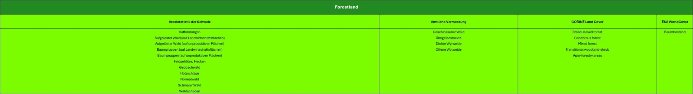

# Datenaufarbeitung

Alle Datensätze wurden heruntergeladen und vorprozessiert, um für die Analyse einen geeigneten Datenstand vorliegen zu haben. Die Metadaten wurden einheitlich definiert und aufgearbeitet

## Metadaten der verwendeten LULC-Datensätzen
In den nachfolgenden Kapiteln sind die Metadaten der verwendeten Datensätzen, Arealstatistik, Amtliche Vermessung, CORINE LandCover und ESA WorldCover zusammengefasst aufgeführt. 

###	Metadaten Arealstatistik der Schweiz
Quelle: Bundesamt für Statistik (BFS)
Jahr: 1979–1985, 1992–1997, 2004–2009, 2013–2018, 2020–2025
Koordinatensystem: EPSG:2056 – LV95
Auflösung: 100m Stichprobenraster (±50m geometrische Unsicherheit)
Erfassungsmethode
Die Arealstatistik des BFS ist das offizielle Schweizer Referenzprodukt zur Erfassung der Bodennutzung und Bodenbedeckung. Sie basiert auf Luftbildern (swisstopo) und einem Stichprobenraster von 100m mit rund 4,1 Mio. Punkten (BFS, 2024b). Jeder Punkt repräsentiert 1ha und wird einer Kategorie der Bodenbedeckung (NOLC04) und Bodennutzung (NOLU04) zugeordnet (BFS, 2006). Kategorien: NOAS04 (Standardnomenklatur, 72 Grundkategorien) auch ersichtlich in Abbildung 4, nach Bundesamt für Statistik (2013) und Bodennutzung (NOLU04) nach Bundesamt für Statistik  (2015), Aggregation zu 17 Klassen und 4 Hauptbereichen (Siedlung, Landwirtschaft, bestockte, unproduktive Flächen) (BFS, 2018). 
Attributstruktur 
RELI, E_COORD, N_COORD, GMDE, GMDE_HISTID, FJ85–FJ25, METHOD25, REVISION25, ASaa_xx, LCaa_xx, LUaa_xx  Details siehe Variablenbeschreibung in den BFS-Metadaten
(BFS, 2024a). Die Inhalte der Grundkategorien und deren Aggregate der drei Nomenklaturen NOAS2004 (Standardnomenklatur), NOLC2004 (Bodenbedeckung) und NOLC2004 sind in der Variablenliste beschrieben (BFS, 2024b).
Qualität
Geometrische Unsicherheit ±50m, hohe methodische Konsistenz, Kombination von manueller und automatisierter Klassifikation.
Dokumentation
Nomenklatur, Metadaten, Geodatensatzbeschreibung über die BFS-Webseite. 
Bemerkungen
Offizielles nationales Referenzprodukt, konsistente Zeitreihe seit Ende der 1970er-Jahre, Datengrundlage für LULC-Vergleiche.
###	Metadaten Amtliche Vermessung
Quelle: Amtliche Vermessung Schweiz, geodienste.ch
Jahr: 2025
Koordinatensystem: EPSG:3035, ETRS89
Auflösung: Abhängig von Bebauungsdichte und Geländeart und Toleranzstufe (TS).
Erfassungsmethode
Erhebung gemäss AV93-Richtlinien und Technischer Verordnung über die Amtliche Vermessung (VAV, 1992, Article 29). 
Attributstruktur 
fid, BFSNr., Qualitaet, Art, GWR_EGID, Kanton. Wertebereich «Art»: Gebäude, Strasse_Weg, Trottoir, Verkehrsinsel, Bahn, Flugplatz, Wasserbecken, übrige_befestigte, Acker_Wiese_Weide, Reben, übrige_Intensivkultur, Gartenanlage, Hoch_Flachmoor, übrige_humusierte, stehendes_Gewaesser, fliessendes_Gewaesser, Schilfguertel, geschlossener_Wald, Wytweide_dicht, Wytweide_offen, übrige_bestockte, Fels, Gletscher_Firn, Geroell_Sand, Abbau_Deponie, übrige_vegetationslose.(Grüter, 2024)
Klassifikationssystem
AV-Bodenbedeckungskatalog (Attribut «Art»).
Qualität
TS2 ±0.10m (dicht bebaute Gebiete), TS3 ±0.20m (Siedlungsrand), TS4 ±0.50m (landwirtschaftliche Gebiete), TS5 ±1.00m (Alp- und Waldgebiete) (swisstopo, 2024).
Dokumentation
Beschrieb der einzelnen Arten verfügbar über geodienste.ch.
Bemerkungen 
Vektorbasierte Erfassung; Grundlage für Bau- und Katasterwesen; regionale Unterschiede in Erfassungsqualität.
###	Metadaten CORINE Land Cover (CLC)
Quelle: European Environment Agency (EEA)
Jahr: 2018
Koordinatensystem: EPSG:4326 – WGS 84
Auflösung: 100m Raster, Mindestkartiereinheit 25ha
Erfassungsmethode
Visuelle Interpretation von Satellitenbildern, bei der erfahrene Fachpersonen Landbedeckungs- und Landnutzungsklassen nach einer standardisierten Nomenklatur zuweisen. Dabei werden geometrische, spektrale und kontextuelle Informationen der Bilddaten berücksichtigt, um eine einheitliche und europaweit vergleichbare Klassifikation sicherzustellen. Ergänzend kommen halbautomatische Verfahren zum Einsatz, bei denen algorithmische Analysen und KI-gestützte Modelle die visuelle Interpretation unterstützen (Büttner et al., 2017).
Attributstruktur
CLC_CODE, LABEL3, RGB.
Klassifikationssystem
CLC-Level 3, 44 Klassen. Hierarchisch gegliedert in Level 1–3. Auch in Tabelle 2 ersichtlich. 
Qualität 
Europaweit harmonisierte Methodik; Qualitätskontrolle durch nationale Validierungsstellen.
Dokumentation
Alle Dokumentationen von CLC befinden sich auf der zugehörigen Webseite und im Produkthandbuch. Technische Richtlinien von 2018: Klassifikationsmethodik, Mindestklasseneinheiten, etc.
Bemerkungen
Geeignet für grossräumige Vergleichsanalysen; Mindestkartiereinheit limitiert Detailgrad in urbanen Gebieten. 
###	Metadaten ESA WorldCover 10 m
Quelle: European Space Agency (ESA)
Jahr: 2021
Koordinatensystem: EPSG:4326 – WGS 84
Auflösung: 10m Raster
Erfassungsmethode
Automatische Klassifikation basierend auf Sentinel-1(Radar) und Sentinel-2 (optisch) Daten. und wird mithilfe eines Random-Forest Klassifikationsverfahrens generiert (Van De Kerchove et al., 2022). Dabei werden aus einem vollständigen Jahreszyklus vorverarbeitete, atmosphärenkorrigierte und mosaikierte Aufnahmen analysiert. 
Attributstruktur
Rasterwerte 10–100, definierte Farbcodes.
Klassifikationssystem
11 Klassen, Farbwerte und QGIS-Codes gemäss ESA-Dokumentation (Van De Kerchove et al., 2022) siehe auch Tabelle 3: Klassifikationen und Darstellung gemäss ESA & Google Earth Engine (Google Earth Engine, 2022).
Qualität
Globale Abdeckung, Validierung durch ESA; Genauigkeit ~75–80%.
Dokumentation
Sind auf WorldCover (Van De Kerchove et al., 2022) und auf Google Earth Engine (Google Earth Engine, 2022) nachzusehen.
##	 Vorprozessesierung
Im Rahmen der Vorprozessierung wurden mehrere Schritte durchgeführt, um die Datengrundlage für die weitere Analyse vorzubereiten und zu vereinheitlichen. Zunächst wurde das Koordinatensystem der Daten auf das Schweizer Referenzsystem EPSG 2056 transformiert. Anschliessend wurde bei den CORINE Land Cover & ESA WorldCover Daten, ein 1km breiter Puffer um die Landesgrenzen der Schweiz erstellt. Auf Basis dieser gepufferten Grenze erfolgte ein Zuschnitt der Daten, sodass nur die relevanten räumlichen Informationen innerhalb des erweiterten Schweizer Gebiets erhalten blieben. Darüber hinaus wurden vorhandene Exklaven aus dem Datensatz entfernt, um eine saubere und zusammenhängende Geometrie sicherzustellen. Nach Abschluss der Bearbeitungsschritte wurden die aufbereiteten Daten gespeichert und abschliessend einer Vollständigkeitsprüfung unterzogen, um sicherzustellen, dass alle relevanten räumlichen Elemente korrekt und vollständig übernommen wurden. 
Die Bodenbedeckungsdaten der Amtlichen Vermessung wurden über Prof. Dr. Christian Gamma und geodienste.ch als shp-Datei bezogen. Dabei wurde festgestellt, dass die Bodenbedeckungsdaten nicht über die ganze Schweiz vorhanden waren. Im Rahmen der Vollständigkeitsüberprüfung wurden die Bodenbedeckungsdaten mit den Gemeindeflächen des swissBOUNDARIES3D-Datensatzes verglichen. Bei Gemeinden, bei welchen für weniger als 99% der Fläche Daten vorhanden waren, wurde eine Sperrfläche erstellt und jene Gemeinden wurden von der anschliessenden Analyse ausgeschlossen. Dies betraf vor allem Gemeinden im Kanton Wallis und einzelne Gemeinde im Kanton Tessin. Die Daten des Kantons Luzern wurden an den NOAS04 angepasst, damit alles Bodenbedeckungsdaten denselben Standard aufwiesen. Weiter mussten alle Gemeinden im Kanton Luzern zusammengeführt werden. In einem nächsten Schritt wurden sämtliche Daten in eine Geopackage-Datei zusammengeführt. Anschliessend wurde die Geometrie der Polygone überprüft. Dabei wiesen etwa 150 der insgesamt 7,2 Mio. Polygone Fehler auf, welche danach bereinigt wurden. 
Für die anschliessende Analyse wurde schliesslich ein Testgebiet definiert. Hierfür wurde der Kanton Zug als Untersuchungsgebiet ausgewählt und entsprechend aus den vorbereiteten Daten ausgeschnitten. Die Wahl fiel auf den Kanton Zug, da dieser flächenmässig zu den kleineren Kantonen der Schweiz gehört und sich daher besonders gut für Testzwecke eignet. Sein überschaubares Gebiet ermöglicht eine effiziente Verarbeitung und Analyse.

##	Kategorien LULC-Daten zu IPCC-Kategorien
Damit die vier verwendeten LULC-Datensätze vergleichbar werden, mussten ihre Klassenstrukturen zunächst vereinheitlicht werden. Die Datensätze unterscheiden sich stark in Anzahl, Detaillierungsgrad und inhaltlicher Definition der Kategorien. Eine direkte Zuordnung zur IPCC-Systematik war dadurch nur teilweise möglich.
Für die Arealstatistik konnte die offizielle Zuordnungstabelle aus der Dokumentation von FOEN (2022, p. 352) verwendet werden. Diese Zuordnung ist auch in der Abbildung 5 in diesem Dokument ersichtlich. Für CORINE, ESA WorldCover und die Amtliche Vermessung existierten keine vergleichbaren direkten Referenztabellen. Die Klassenzuordnung musste deshalb modelliert und überprüft werden. Dazu wurden die Kategorien zunächst nach inhaltlichen Beschreibungen und Deckungsmerkmalen vorläufig den IPCC-Hauptkategorien zugeteilt. Mehrdeutige oder unklare Klassen wurden anhand von Beispielen aus dem Testgebiet des Kantons Zug verifiziert. Das Gebiet eignete sich, weil durch die voralpine Topografie und die urbane Durchmischung nahezu alle relevanten Klassen vorkommen. Die Zuordnung der Kategorien wurde dabei mehrfach angepasst, bis die räumlichen Muster in allen Datensätzen konsistent und plausibel waren. Klassen ohne eindeutige Übereinstimmung wurden gemäss den beobachtbaren Boden- und Vegetationsbedingungen eingeordnet.
Die Visualisierung in Abbildung 11 zeigt die resultierende Zuordnung aller vier Datensätze auf die sechs IPCC-Hauptkategorien. Sie macht sichtbar, welche und wie viele Kategorien der einzelnen Datenquellen einer IPCC-Kategorie zugeordnet wurden und ermöglicht eine transparente Überprüfung aller Zuordnungsentscheidungen. Die Harmonisierung stellt sicher, dass Flächenanteile und Veränderungen klar zwischen den Datensätzen verglichen und in den IPCC-LULUCF-Rahmen integriert werden können.
Alle verwendeten Tabellen sowie das Python-Skript zur automatischen Generierung der Visualisierung sind im zugehörigen GitHub-Repository verfügbar. Dadurch ist die gesamte Zuordnung reproduzierbar und kann bei Bedarf erweitert oder auf andere Gebiete übertragen werden.

  

Abbildung 11: Zuordnungen der Kategorien aller Datensätze auf die IPCC-Kategorien 

[↑](#top)

  

    <a href="02_literaturrecherche.html">← Literaturrecherche</a>
  

  

    <a href="04_arealstatistik_vs_av.html">Vergleich Arealstatistik vs Amtliche Vermessung →</a>
  

