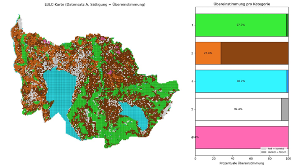
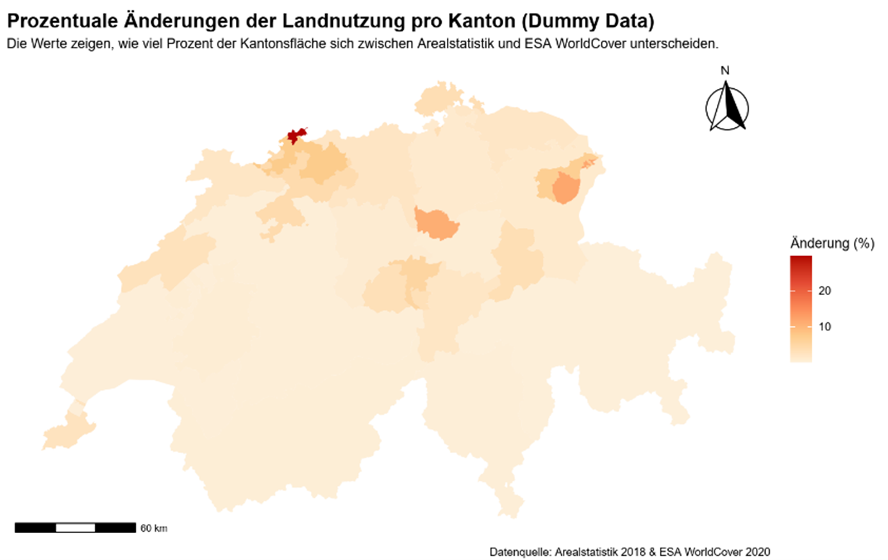
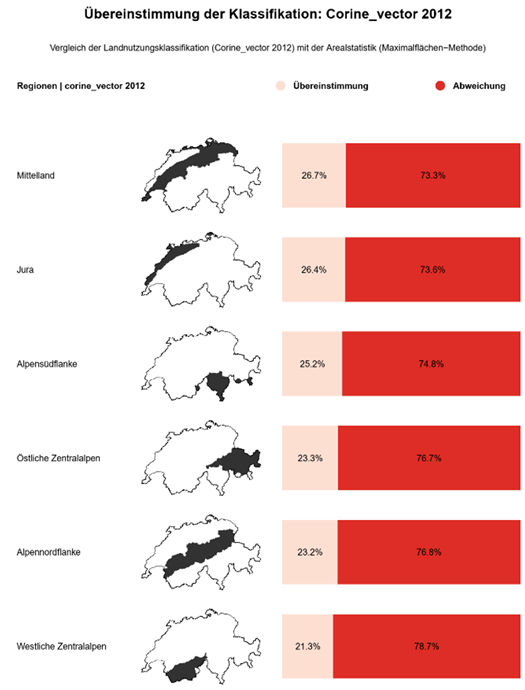
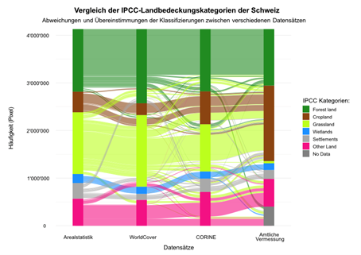
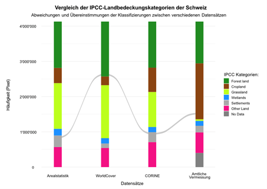

# Visualisierungen
Um die Aussagen der Analysen zu veranschaulichen und verständlich zu kommunizieren wurden verschiedene Visualisierungsideen entwickelt und die Besten davon umgesetzt. Wichtig ist es das die Visualisierung auf jeden Datensatzvergleich anwendbar sind. Dazu wurden in 
Python-Funktionen implementiert, welchen man verschiedene Datensätze übergeben kann.

---

## Übersichtskarte mit Balkendiagramm
Für explorative und anschliessend auch definitive Aussagen über den Übereinstimmungsvergleich zu treffen, wurden die prozentualen Werte in einer Karte sowie einem Balkendiagramm dargestellt. Es wurde eine analytische Legende erstellt, damit alle Informationen in einer Visualisierung kompakt dargestellt werden können. Hierfür wurde ein Python-Skript geschrieben und es wurden die Libraries «Geopandas», «Numpy» und «Matplotlip» verwendet. Das Skript wurde für die allgemeine Nutzung in eine Funktion geschrieben. Diese benötigt einen Geopandas Dataframe, den Attributnamen der Arealstatistik, sowie den Attributname der zu vergleichenden Datenquelle. In ihrer ersten Ausführung wurde die Visualisierung als simple Karte dargestellt, wobei der Balken in der Legende die Farbe der 
IPCC-Kategorie erhalten hat, die entsprechenden Zellen in der Karte wurden auch gleich eingefärbt. Die Füllung der Balken wurde aus der prozentualen Übereinstimmung der beiden oben erwähnten Attributfeldern berechnet und gibt wie in Abbildung 12 zu sehen, den prozentualen Wert der übereinstimmenden Klassifikationen wieder. 

  

**Abbildung 12**: Erste Version der Kategorienkarte mit analytischer Legende.

Die Restfläche der Balken wurde in einer dunkleren Variante des gleichen Farbtones gefüllt, damit diese zwar als ähnlich erkannt werden aber trotzdem einen Unterschied darstellt. Die Farben im Balkendiagramm wurden auch den Zellen entsprechend ihrer Kategorie, sowie ihrer Übereinstimmung hell oder dunkel eingefärbt.
Die Hauptaussage dieser Visualisierung ist die prozentuale Übereinstimmung der einzelnen Kategorien, was in dieser Version noch nicht klar ersichtlich ist. Zudem erhaltet die Kategorie «Other Areas» das gleiche Gewicht im Diagramm wie beispielsweise Forest Land. Dies ist irreführend, da die erstere Kategorie einen kleinen Bruchteil der zweiteren Kategorie wiederspricht. 
In Abbildung 13 wurde die Balkendicke auf ihren prozentualen Anteil der Kategorie im Datensatz angepasst und die Reihenfolge wurde von der grössten Kategorie bis zur kleinsten sortiert. 

  

**Abbildung 13**: Finale Version der Kategorienkarte mit analytischer Legende

Ähnlich wie die Berechnung der Säulen selbst wurde die Breite gemäss der Prozentzahl über den gesamten Datensatz berechnet. Diese wurden dann als Wert pro Kategorie gespeichert und dargestellt. Abschliessend wurde die Beschriftung von Karte und dem Diagramm optimiert. 
4.2	Geografische Aggregation
Um über unterschiedliche geografische Gebiete Aussageben über die Qualität der verschiedenen LULC-Datensätzen treffen zu können wurden zunächst eine R-Funktion erstellt, welche einen Vergleichsdatensatz auf solche Gebiete aggregieren kann. 

  

**Abbildung 14**: Erste Version der Aggregationsvisualisierung 

Der grundlegende Ablauf besteht darin, dass alle identifizierten Landnutzungsänderungen zunächst über eine räumliche Verknüpfung den jeweiligen Zielgebieten zugeordnet werden. Anschliessend wird die Fläche der Änderungen innerhalb jeder Region berechnet und mit der Gesamtfläche der Region in Beziehung gesetzt. Dadurch entsteht ein prozentualer Indikator, der beschreibt, wie gross der Anteil der abweichend klassifizierten Fläche innerhalb eines Gebietes ist. Dieser Wert dient als Grundlage für die nachfolgende Visualisierung. 
In einer ersten Version wurde eine Karte mit einem Verlauf erstellt, welcher die prozentualen Änderungen der geografischen Fläche symbolisieren soll (siehe Abbildung 14). Da diese Darstellung nicht in das visuelle Gesamtkonzept passt und nicht eindeutig dargestellt wird wieviel Prozent sich geändert- und wieviel gleichgeblieben sind, wurde diese nochmal komplett überarbeitet. Es wurde also ein R-Skript erstellt, welches für jede geografische Einheit eine neue Zeile erstellt. Jede Zeile enthält einen Titel, eine Minikarte, in der das Gebiet farblich hervorgehoben wird und ein gestapeltes Säulendiagramm. Das gestapeltes Säulendiagramm zeigt den Anteil korrekt klassifizierter Flächen und den Anteil der Abweichungen (Abbildung 15).

  

**Abbildung 15**: Finale Version der Aggregationsvisualisierung 

Das Gute an der Visualisierung ist, dass diese auf alle möglichen geografischen Einheiten aggregiert werden kann wie z.B. über Kantone oder Gemeinden. Aber im Falle dieses Projekts ist eine Aggregation nach biogeografischen Kategorien sinnvoller, weil diese natürlichen Räume mit ähnlichen klimatischen und topografischen Bedingungen zusammenfassen. Dadurch entstehen fachlich homogenere Vergleichsgebiete, was die Interpretation der Unterschiede zwischen den LULC-Datensätzen erleichtert. Kantonsgrenzen hingegen sind administrativ geprägt und spiegeln diese landschaftlichen Zusammenhänge nicht wider.

---

## Übergangsmatrix
Zur Bewertung der Übereinstimmung zwischen zwei LULC-Datensätzen wurde ein Skript erstellt, das eine auf Punktdaten basierende Übergangsmatrix generiert. Zunächst werden beide Datensätze als Geopandas Dataframe geladen und alle Punkte herausgefiltert, bei denen für beide Datenquellen gültige Klassenwerte vorliegen. Die jeweiligen Klassenspalten werden anschliessend als «y_true» und «y_pred» definiert und mithilfe einer Funktion aus «scikit-learn» gegenübergestellt. Die resultierende Matrix wird in einen Pandas Dataframe überführt, zeilenweise normalisiert und in Prozentwerte umgerechnet, um die relativen Häufigkeiten pro Referenzklasse interpretierbar zu machen. Nach der Abbildung der numerischen Codes auf die entsprechenden IPCC-Klassennamen erfolgt die Darstellung als Intensitätsmatrix. Die Visualisierung zeigt nicht nur, wie viele Pixel identisch klassifiziert wurden, sondern macht auch deutlich sichtbar, welche Klassen voneinander abweichen und in welchem Ausmass die Fehlzuordnungen auftreten. Dadurch lassen sich Muster erkennen, etwa Klassen mit hoher Übereinstimmung sowie solche, bei denen häufiger Verwechslungen vorkommen. Eine zentrale Herausforderung bestand darin, eine geeignete Farbklasseneinteilung zu wählen, sodass sowohl hohe Übereinstimmungen als auch gröbere Abweichungen klar hervortreten. Sehr kleine Prozentwerte erzeugten jedoch ein schwer interpretierbares Bild. Daher wurden Werte unter 2% ausgeblendet und transparent dargestellt, um visuelles Rauschen zu reduzieren. Die abschliessende Farbskala basiert auf klar definierten Klassenintervallen: 2–10%, 10–20%, 20–50%, 50–75% und bis 100%.

---

## Alluvial Diagramm
Ein Alluvial-Diagramm wie in Abbildung 16 vergleicht die Landbedeckung der Schweiz zwischen verschiedenen Datensätzen, jeweils klassifiziert nach den IPCC-Landnutzungskategorien. Jede vertikale Säule steht für einen Datensatz (Arealstatistik, Amtliche Vermessung, CORINE Land Cover, ESA WorldCover). Die Säule ist in farbige Bereiche unterteilt, die jeweils eine 
IPCC-Landbedeckungskategorie darstellen. Die Höhe eines farbigen Bereichs zeigt, wie viele Rasterpixel in diesem Datensatz in diese Kategorie fallen. 
Die farbigen Alluvien (Flüsse) zwischen den Säulen zeigen, wie dieselben Pixel im jeweils nächsten Datensatz klassifiziert wurden. Die Farbe der Alluvien richtet sich nach der Ausgangsklasse aus der Arealstatistik. Breite Flüsse zeigen, dass viele Pixel in derselben Kategorie verbleiben oder gemeinsam in eine andere Kategorie wechseln. Schmale Flüsse weisen darauf hin, dass nur wenige Pixel gleich zugeordnet werden oder den Kategorien wechseln.
Im vorliegenden Fall wurde der Vergleich der Pixelklassifizierung auf jedem Datensatz mit der Cell Center Methode durchgeführt. Um die Lesbarkeit zu verbessern und das Diagramm übersichtlich zu halten, werden Flüsse mit weniger als 5’000 Pixeln transparent dargestellt. 
Abbildung 17 ist eine Interpretationshilfe für das Alluvial-Diagramm. In diesem Beispiel erkennt man einen schmalen grauen Fluss, der sich durch das gesamte Diagramm zieht. Er beginnt im Datensatz der Arealstatistik in der Kategorie «Settlements». Deshalb ist der Fluss grau eingefärbt, denn die Farbe richtet sich nach der ursprünglichen Klassifizierung in der Arealstatistik. Im nächsten Datensatz, ESA WorldCover, werden dieselben Pixelanzahl jedoch als «Forest land» eingestuft, bevor er im darauffolgenden Datensatz CORINE Land Cover wieder zurück in die Kategorie «Settlements» wechselt. Im letzten Datensatz, der Amtlichen Vermessung, wandert der graue Fluss schliesslich in die braune Säule der Kategorie «Cropland».

  

**Abbildung 16**: Alluvial-Diagramm der LULC-Datensätze

  

 
**Abbildung 17**: Beispiel zur Interpretation des Alluvial-Diagramms der LULC-Datensätze

[↑](#top)

  

    <a href="03_datenaufarbeitung.html">← Datenaufarbeitung</a>
  

  

    <a href="05_arealstatistik_vs_corine.html">Vergleich Arealstatistik vs Corine LandCover →</a>
  

