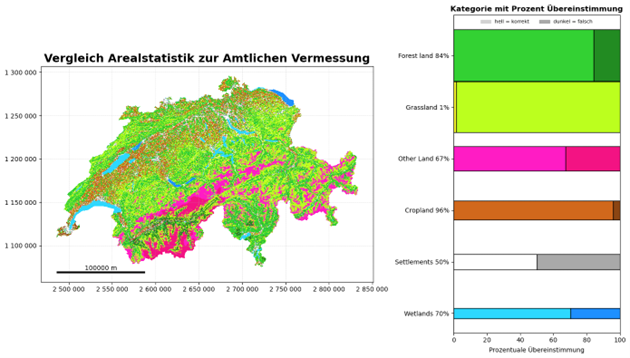
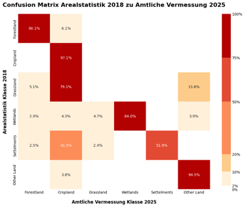
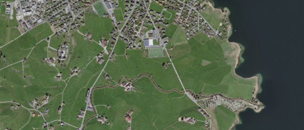

# Vergleich Arealstatistik - Amtliche Vermessung

In diesem Kapitel wird die Unterschiedlichkeit der Landnutzungs- und Landbedeckungsdaten der Amtlichen Vermessung zur Arealstatistik untersucht. Verglichen werden die Datensätze hinsichtlich Klassifikationen, Genauigkeiten und Unsicherheiten. Die Analyse von Unsicherheiten und Veränderungen durch den Referenzrahmenwechsel von LV95 auf LV03 entfiel, da in der Amtlichen Vermessung nur ein aktueller Zeitstand von Oktober 2025 vorlag, mit welchem die Analyse durchgeführt wurde.

---

## Vorgehen und Methodik
Die Bodenbedeckung der Amtlichen Vermessung und die Arealstatistik wurden mithilfe der Methoden Cell Center und Max Area miteinander verglichen. Bei beiden Methoden wurde zuerst um das Zentrum der Punkte der Arealstatistik ein 100m Gitter erstellt.
Bei der Methode Cell Center wurde dann eine räumliche Verbindung zwischen dem Mittelpunkt der Boxen und den Polygonen der Bodenbedeckung der Amtlichen Vermessung durchführt. Dadurch wurde den Daten der Arealstatistik die Bodenbedeckungsart der Amtlichen Vermessung im Zentrum jeder Box hinzugefügt. Bei Mehrfachzuweisungen wurde jeweils nur die erste Zuweisung weiterverwendet. Anders ist es bei der Methode Max Area. Hier wurden die Polygone der Bodenbedeckung mit den zuvor erstellten Boxen verschnitten. Anschliessend wurde der Flächenanteil jeder Bodenbedeckungsart pro Box berechnet. Die Bodenbedeckungsart, welche in der Box prozentual am meisten vorkommt, wurde für die weiteren Schritte übernommen. Bevor die Klassen der Arealstatistik und der Amtlichen Vermessung pro Zelle auf Übereinstimmung geprüft werden konnten, wurden die Klassen der beiden Datensätze die sechs IPCC-Klassen zugewiesen. In einem letzten Schritt wurden die zuvor erstellten Attribute «AV_IPCC» und «AS_IPCC» miteinander verglichen.

---

##	Ergebnisse der Analyse
Nachfolgend ist eines der Ergebnisse des Vergleichs ersichtlich. Bei Abbildung 18 handelt es sich um das Resultat der Methode Cell Center, da mit dieser Methode eine bessere Übereinstimmung über alle Kategorien erreicht wurde. Auffallend ist, dass sowohl in der Kartendarstellung als auch in der Übergangsmatrix in Abbildung 19 die Kategorie «Grassland» eine sehr schlechte Übereinstimmung aufweist. 

  

**Abbildung 18**: Vergleich Arealstatistik / Amtliche Vermessung (Cell Center) 

  

**Abbildung 19**: Übergangsmatrix Arealstatistik / Amtliche Vermessung (Cell Center)

---

##	Diskussion der Vergleichsanalyse AS und AV
Die schlechte Übereinstimmung der Kategorie «Grassland» lässt sich mit den unterschiedlichen Landbedeckungskategorien der einzelnen Datensätze erklären. Bei der Arealstatistik werden die Bodenbedeckungen Ackerland, Weide und Wiese einzeln erfasst. Im Vergleich dazu werden diese drei Bodenbedeckungsarten in der Amtlichen Vermessung in einer einzigen Kategorie «Acker_Wiese_Weide» zusammengefasst. Die IPCC-Kategorien unterscheiden zwischen Ackerland und Wiese/Weide. Beim Abbilden der Kategorien der Amtlichen Vermessung konnte die Kategorie «Acker_Wiese_Weide» nicht aufgeteilt werden und wurde der IPCC-Kategorie «Cropland» zugewiesen. Dies führte zu schlechten Ergebnissen bei der Analyse.
Ein weiterer Grund für die schlechte Übereinstimmung ist, dass die Arealstatistik ihre Daten aus Luftbildern bezieht. Viele der landwirtschaftlichen Flächen waren zu diesem Zeitpunkt grün und wurden daher als Wiese anstatt als Ackerland klassiert. Ein Beispiel dazu zeugt Abbildung 20. 

  

**Abbildung 20**: Unterägeri mit Umland und Ägerisee 

Die restlichen Kategorien wurden gut erkannt und die einzelnen Unterschiede können auf den Zeitunterschied der beiden Datensätze zurückgeführt werden. Grenzen von Klassen, welche schummrig sind wie z. B. Waldrand wurden ebenfalls gut erkannt, anders als in der 
Konzeptphase angenommen. 

[↑](#top)

  

    <a href="04_arealstatistik_vs_av.html">← Vergleich Arealstatistik vs Amtliche Vermessung</a>
  

  

    <a href="06_arealstatistik_vs_worldcover.html">Vergleich Arealstatistik vs ESA WorldCover →</a>
  

