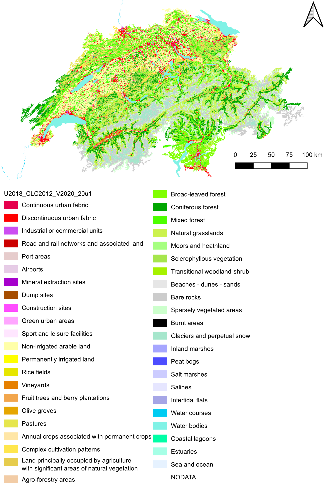
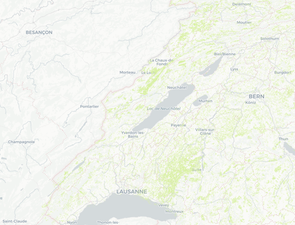

# Vergleich Arealstatistik - CORINE Land Cover

Dieses Kapitel untersucht die inhaltlichen Unterschiede zwischen der Arealstatistik und dem CORINE Land Cover Datensatz. Im Zentrum steht der Vergleich der Unterschied der jeweiligen Klassifikationssysteme, die räumliche und thematische Auflösung sowie der unterschiedliche methodische Ansatz der den beiden Produkten zugrunde liegen.

---

##	Vorgehen und Methodik
Da der Datensatz von CORINE Land Cover einerseits als Raster- als auch als Vektordatensatz vorliegt, wurden für beide Datensätze verschiedene Untersuchungsmethoden verwendet.

---

###	Rasteranalyse
Das Arealstatistik Punktraster und das CORINE Land Cover Raster besitzen dieselbe räumliche Auflösung. Sie unterscheiden sich jedoch leicht in ihrer räumlichen Ausrichtung. Das bedeutet, dass die Gitterzellen der beiden Rasterdatensätze nicht exakt deckungsgleich sind. Um einen direkten Vergleich zu ermöglichen, wurde das CORINE Land Cover Raster auf die Stichprobenpunkte der Arealstatistik projiziert. Dabei wurde der Pixelwert des CORINE Land Cover Rasters an den exakten Koordinaten der Arealstatistikpunkte abgefragt. Auf diese Weise erhält jeder Arealstatistikpunkt den entsprechenden CORINE Land Cover Klassenwert, der am gleichen Ort in der Landschaft vorliegt.
Anschliessend erfolgte eine Kategorisierung beider Datensätze nach dem 
IPCC-Landklassifikationsschema. Dazu wurde eine Zuordnungstabelle erstellt, welche die einzelnen Klassen der Arealstatistik bzw. des CORINE Land Cover Datensatzes den übergeordneten IPCC-Hauptkategorien zuordnet. Durch diese Zuordnung entsteht eine Vergleichstabelle, die für jeden Punkt folgende Informationen enthält:
•	den ursprünglichen Klassenwert und die Bezeichnung der Arealstatistik,
•	den gesampelten Klassenwert und die Bezeichnung des CORINE Land Cover Rasters,
•	sowie die jeweiligen IPCC-Kategorien numerisch und textuell.
Diese Tabelle bildet die Grundlage für den quantitativen und räumlichen Vergleich der Landbedeckungsinformationen. Auf Basis dieser Daten können Abweichungen zwischen den beiden Datensätzen identifiziert, räumliche Muster analysiert und Hotspots der Klassifikationsunterschiede kartiert werden. Die Punkte wurden dann als Vektorraster gespeichert, sodass sie dem 100m Raster der Arealstatistik entsprechen. Für die weiteren Schritte und die Visualisierungen wurden die Daten von der Vektoranalyse verwendet.

---

###	Vektoranalyse
Der CORINE Land Cover Vektordatensatz liegt als Geopackage vor und bildet sämtliche CORINE Land Cover Kategorien ab. Der Datensatz ist auf der Folgeseite in Abbildung 21 dargestellt. Um die CORINE Land Cover Daten mit anderen Datensätzen, im Speziellen demjenigen der Arealstatistik zu vergleichen, wurden zwei Methoden zur Rasterisierung von Landbedeckungsdaten aus Kapitel 2.3.2 angewendet. In einem ersten Schritt wurde die Methode Max Area angewendet, woraufhin auch die Methode Cell Center eingesetzt wurde. Grundsätzlich ist die Anwendung beider Methoden nicht notwendig und wurde durchgeführt, um einen Vergleich zwischen den Methoden möglich zu machen. 
Letztendlich wurden die Resultate genauso wie im vorhergehenden Kapitel 6.1.1 den entsprechenden IPCC-Kategorien zugeordnet. Die Arealstatistik aus dem Jahr 2009 wurde mit den CORINE Land Cover Daten von 2012 verglichen und für das Jahr 2018 lagen beide 
Datensätze vor. 
 

  

**Abbildung 21**: CORINE Land Cover Vektordatensatz

---

##	Ergebnisse der Analyse
Die Resultate der Vergleichsanalyse wurden in verschiedene Formen visualisiert und analysiert. In der explorativen Phase wurde dann eine Anpassung an der Zuordnungsabelle zwischen den CORINE Land Cover und den IPCC-Kategorien durchgeführt. Die zuvor als Cropland eingestuften CORINE Land Cover Kategorien «Complex cultivation patterns» und «Pastures» wurden neu der IPCC-Kategorie Grassland zugeordnet. 
Insgesamt ist über alle CORINE Land Cover Datensätze erkennbar, dass es vor allem in den 
IPCC-Kategorien Grassland und Seattlements zu Unstimmigkeiten zwischen der Arealstatistik und CORINE Land Cover kam. Vor allem in der Kategorie Grassland ist es nach wie vor möglich, dass es in der Zuordnungstabelle zu systematischen Abweichungen kommt. Ein gehäuftes Auftreten der Abweichungen finden sich in den Gebirgen der Westschweiz und sind in Abbildung 22 einsehbar. Eine erhöhte Anzahl wurde als Cropland statt als Grassland eingeordnet. 

  

**Abbildung 22**: Bereiche mit Unterschieden zwischen Arealstatistik und CORINE Land Cover in der IPCC-Kategorie Grassland

Eine besonders gute Übereinstimmung wurde in der Kategorie Other Land erreicht. In der nachfolgenden Tabelle 5 ist zudem ersichtlich, dass sich die statistischen Grössen zwischen den Methoden Cell Center und Max Area kaum variieren. Detaillierte Einblicke in die Statistik aller Vergleichsanalysen finden sich in Kapitel 9.
 
| Kennzahl   | Cell Center | Max Area |
|------------|-------------|----------|
| accuracy   | 0.753       | 0.752    |
| precision  | 0.768       | 0.766    |
| recall     | 0.753       | 0.752    |
| f1_score   | 0.751       | 0.750    |
| kappa      | 0.682       | 0.680    |

**Tabelle 5**: Statistischer Vergleich zwischen der Arealstatistik 2009 und dem CORINE Land Cover Vektordatensatz 2012

##	Diskussion der Vergleichsanalyse AS und CLC
Insgesamt konnten mit dem CORINE Land Cover Datensatz gute Resultate erzielt werden. Die Methode Cell Center führte insgesamt zu einer minim besseren Übereinstimmung mit der Arealstatistik als die Methode Max Area. Ob diese dadurch eine bessere Abbildung der Realität darstellt, bleibt ungewiss. 
Vor einer weiteren Anwendung des CORINE Land Cover Datensatzes, sollte man die Zuordnung der Kategorien zwischen den Datensätzen vor allem in den Bereichen Grassland und Seattlements überprüft werden. Können diese Abweichungen minimiert werden, ist eine grosse Verbesserung der Resultate möglich. 
 

[↑](#top)

  

    <a href="05_arealstatistik_vs_corine.html">← Vergleich Arealstatistik vs Corine LandCover</a>
  

  

    <a href="07_vergleich_aller_analysen.html">Vergleich aller Analysen →</a>
  

