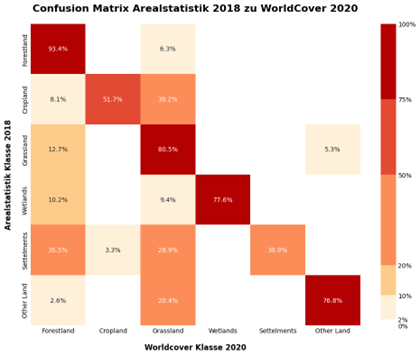
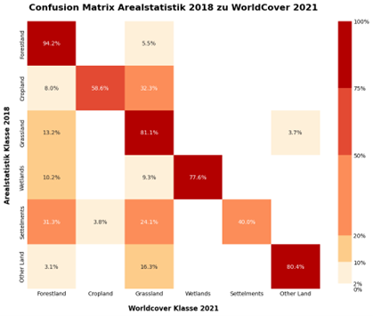
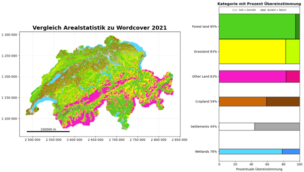

#	Vergleich Arealstatistik - ESA WorldCover
In diesem Kapitel liegt der Fokus auf dem ESA WorldCover Datensatz, wie dieser der Arealstatistik ähnelt und wo er sich unterscheidet. Besonders hervorgehoben wird das Vorgehen und die Methodik, die Ergebnisse durch Visualisierungen und eine Diskussion der Erkenntnisse.

---

##	Vorgehen und Methodik
Da es sich bei den ESA WorldCover Daten um schweizweite 10m Rasterdaten handelt und bei der Arealstatistik um 100m Punktdaten mussten die Datensätze zunächst harmonisiert werden, um eine Vergleichbarkeit zu gewährleisten. Dafür wurde zunächst die offizielle Schweizer Landesgrenze aus den swissBOUNDARIES3D Daten eingelesen und um 1km nach aussen gepuffert. In einem nächsten Schritt wurden die ESA WorldCover Kacheln zusammengefügt und in das Schweizer Koordinatensystem LV95 transformiert. Abschliessend wird das umprojizierte Mosaik mit der gepufferten Grenze maskiert. Das Ergebnis ist ein homogenes, umprojiziertes und zugeschnittenes ESA WorldCover Raster, das für die weiteren Analysen genutzt werden kann. 
Für die Überführung der Vektordaten, in ein einheitliches 100m Raster, wurde die Methode der maximalen Flächenanteilszuweisung bzw. Max Area verwendet. Diese Methode ist in diesem Fall besonders sinnvoll, weil die hochauflösenden ESA WorldCover Daten auf ein gröberes 
100m Raster übertragen werden. Durch die Max Area Methode wird der Klasse mit dem grössten Flächenanteil in der Zelle der Vorrang gegeben. So bleibt die dominante Landbedeckung erhalten, während kleinere, zufällige Pixelabweichungen geglättet werden. Das Problem bei der Methode ist, dass für die Arealstatistik als Punktdaten und nicht als Raster vorliegt. Also musste die Arealstatistik zunächst in eine flächenhafte Form überführt werden, um sie mit den 
ESA WorldCover Daten räumlich verknüpfen und klassifizieren zu können. Dazu wurde um jeden Punkt ein 100m2 grosses Quadrat erzeugt, das die jeweilige Bezugsfläche des Punktes der Arealstatistik repräsentiert. Auf diese Weise entstand ein flächendeckendes 100m Gitter, das als gemeinsame räumliche Grundlage für die spätere Zuordnung und den Vergleich der Klassen diente.
Nun war es möglich mit der Python-Bibliothek «rasterstats» die Anteile der verschiedenen ESA WorldCover Klassen in jeder Arealstatistikzelle zu berechnen und die drei flächenmässig grössten Anteile zu speichern. Diese konnten anschliessend der Arealstatistikzelle als Attribut hinzugefügt werden. Anschliessend gab es eine erste Zuteilung der 72 Arealstatistikklassen zu den elf ESA WorldCover Klassen, wobei die Klasse Mangroven für die Schweiz irrelevant ist, da es keine Mangroven gibt und auch keine von der ESA detektiert wurden. Nach einem ersten Durchlauf mit der Zuteilung gab es eine Kontrolle, ob es Arealstatistikklassen gibt, die besser mit einer anderen ESA WorldCover Kategoire übereinstimmen. Danach wurde dasselbe mit der zweiten Zuteilung durchgeführt, um zu prüfen, ob eine möglichst optimale Zuteilung erreicht ist. Da in den beiden anderen Datensätzen eine Zuteilung auf die sechs IPCC-Klassen gemacht wurde, wurden die zehn ESA WorldCover Klassen ebenfalls auf diese zugeteilt, um diese später besser miteinander vergleichen zu können. Die Klassenzuteilung ist in Abbildung 11 ersichtlich.

---
 
##	Ergebnisse der Analyse
Als Ergebnis werden diverse Visualisierungen erstellt. Nachführend ein kleiner Auszug mit zwei Fehlermatrizen (Abbildung 23 und Abbildung 24) zur Beurteilung der Klassen und einer Karte zur Verteilung der einzelnen IPCC-Klassen (Abbildung 25).

  

**Abbildung 23**: Übergangsmatrix Arealstatistik / ESA WorldCover 2020

  

**Abbildung 24**: Übergangsmatrix Arealstatistik / ESA WorldCover 2021
 

  

**Abbildung 25**: Vergleich Arealstatistik / ESA WorldCover

##	Diskussion der Vergleichsanalyse AS und WC
Aus den Abbildung 23 und Abbildung 24 geht hervor, dass Forestland eine Übereinstimmung von über 93% über beide Zeitstände erreichte. Ebenfalls eine gute Übereinstimmung haben Grasland, Wetlands und Other Land mit gut 80% Übereinstimmung. Cropland und Settlements haben eine überraschend hohe Differenz zwischen den beiden Datensätzen. Settlements wurden oft als Grassland und Forestland klassiert. Cropland wird zu fast einem Drittel als Grasland erkannt. Welche sowohl durch den zeitlichen Unterschied sowie auch durch die unterschiedlichen Erfassungsmethoden entstanden sein könnten. In Abbildung 25 ist ersichtlich wo welche 
IPCC-Kategorien am häufigsten zu finden sind.

[↑](#top)

  

    <a href="06_arealstatistik_vs_worldcover.html">← Vergleich Arealstatistik vs ESA WorldCover</a>
  

  

    <a href="08_zeitliche_veränderung.html">Zeitliche Veränderung der LULC-Daten →</a>
  

