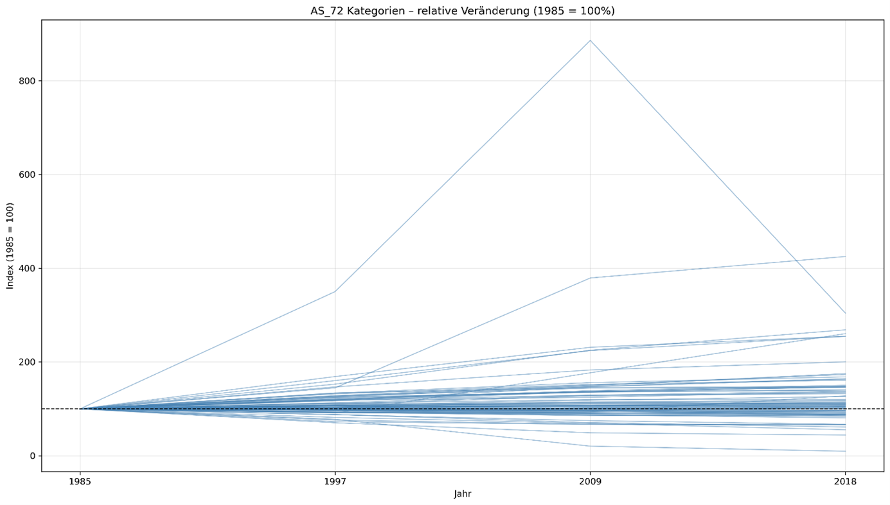
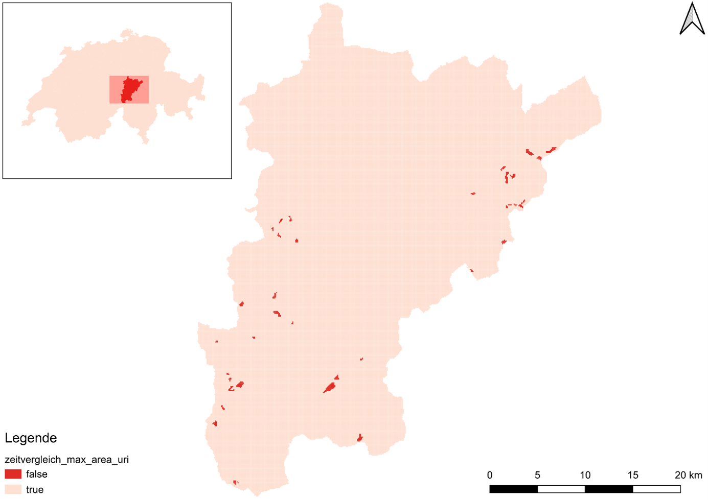
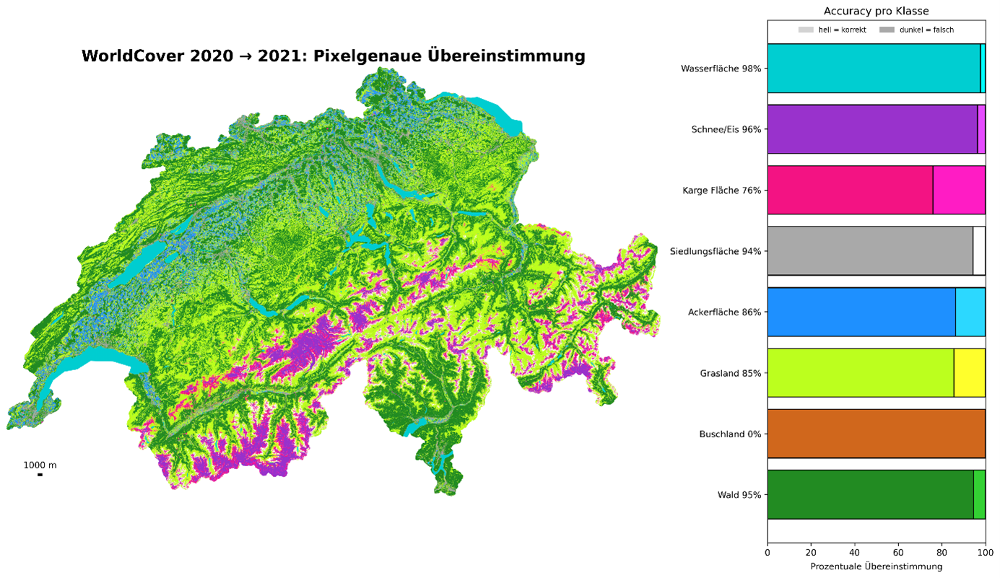
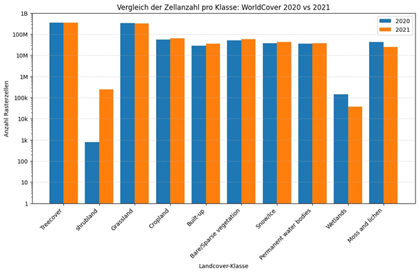

#	Zeitvergleich
In diesem Kapitel werden anders als in den vorhergehenden drei Kapiteln nicht die Daten untereinander verglichen, sondern dieselben Daten unterschiedlicher Zeitstände. Es soll vereinfacht auch aufzeigen, wo Änderungen zwischen den Zeitständen vorkommen und in welchen Gebieten sich auch wenig verändert hat.

---

##	Arealstatistik
Bei der Arealstatistik sind vier Zeitstände vorhanden: 2018, 2009, 1997 und 1985. Bei einem Vergleich der Anzahl Zellen einer Kategorie pro Jahr, stellte sich heraus, dass die grösste absolute Zunahme in den folgenden Klassen vorkommt: Heimweiden, Holzschläge, Fels, Geröll/Sand, Aufgelöster Wald (auf unproduktiven Flächen), Waldschäden, Umschwung von Ein- und Zweifamilienhäusern und Umschwung von Mehrfamilienhäusern und Strassen/Wege. 
Die grösste absolute Abnahme gab es bei den Klassen: Ackerland, Gletscher/Firn, Naturwiesen, Umschwung von Mehrfamilienhäusern, Öffentliche Gebäude, Günstige Alp- und Juraweiden, Gebüsch/Strauchvegetation, Schafalpen und Versteinte Alp- und Juraweiden.

  

**Abbildung 26**: Relative Veränderung der einzelnen Klassen über die Jahre

Bei Betrachtung von Abbildung 26 fallen zwei Klassen besonders ins Auge. Bei der Klasse Waldschäden gibt es erst eine Verdreifachung der Werte von 1985 im Jahr 1997 und dann eine Verneunfachung gegenüber 1985 im Jahr 2009, bevor sie 2018 wieder auf das Niveau von 1997 fällt. Diese Waldschäden entstanden vermutlich durch Krankheiten und Stürme. Der Höhepunkt von 2009 ist vermutlich auch durch das Orkantief Lothar von Dezember 1999 zu Begründen. Bei der prozentual meist angestiegen Klasse seit 1985 handelt es sich um Golfplätze.

---

##	CORINE Land Cover
Da sich auch die Polygone des CORINE Land Cover Vektordatensatzes über die Jahre verändern können, wurde der Vergleich zwischen den vorliegenden Datenständen von 2012 und 2018 auf die Kantone aggregiert. Diese Aggregation fand ebenfalls mit der bereits definierten Methode Max Area statt. Dabei fiel auf, dass die einzige Änderung in den Vektordaten im Kanton Uri stattfand. Bei einer detaillierteren Analyse des Kantons, ist in Abbildung 27 ersichtlich, dass lediglich kleinste Bereiche eine Änderung in der CORINE Land Cover Kategorie erfuhren. In den dunkelroten Bereichen traf keine Übereinstimmung ein und der Datenpunkt wurde entsprechend gefärbt.  

  

**Abbildung 27**: LULC-Veränderung zwischen den CORINE Land Cover Vektordatensätzen von 2012 und 2018

In einem Grossteil der Fälle lagen die Datenpunkte im Jahr 2012 in der Kategorie «Glaciers and perpetual snow» vor und änderten bis 2018 zu «Bare rocks». Diese Veränderung sind auf Grund der klimatischen Veränderung und höheren Temperaturen in der Innerschweiz gut begründbar. 

---

##	ESA WorldCover
Für die Analyse der zeitlichen Veränderungen der Landbedeckung wurde ein direkter Vergleich der ESA WorldCover Datensätze für die Jahre 2020 und 2021 durchgeführt. Beide Raster besitzen die gleiche Ausdehnung und Auflösung. Jeder Pixel enthält einen Identifikator entsprechend der ESA WorldCover Legende. Für die Analyse werden ausschliesslich die Kategorien berücksichtigt, welche im Datensatz tatsächlich vorkommen. 
Für den Zeitvergleich war es zunächst angedacht wie bei den früheren Analysen ein künstliches 10m Gitter zu erzeugen. Dadurch würde es möglich, mehrere Attribute zu speichern, was den Vergleich sehr einfach gemacht hätte. Dieses Vorgehen hätte jedoch für den grossflächigen Datensatz über die ganze Schweiz zu einer sehr hohen Anzahl an Polygonen geführt und damit zu beträchtlichem Speicher- und Rechenaufwand. Da das Gitter exakt der Rasterauflösung entspricht, entsteht zudem keinerlei zusätzlicher Informationsgewinn. Die Pixelwerte würden lediglich als Polygone dupliziert werden, ohne inhaltlichen Mehrwert. Gleichzeitig erhöht eine solche Vektorisierung die Fehleranfälligkeit. Aus diesen Gründen wurde der gitterbasierte Ansatz verworfen und stattdessen ein, pixelgenauer Raster zu Raster Vergleich umgesetzt, der sowohl effizienter als auch methodisch präziser ist.
Dafür wurde zunächst ein neues Raster erstellt, das sowohl unveränderte als auch veränderte Pixel kodiert. Um den Speicherbedarf zu schonen und den RAM nicht zum Überlaufen zu bringen wurde ein Einkanalraster mit dem Datentyp «uint8» erzeugt. Dieser Datentyp ist ausreichend, weil alle möglichen Werte kleiner als 255 sind.
 
Die Codierung des Rasters wurde nachfolgend festgelegt:
•	Unveränderte Pixel (gleiche Kategorie 2020 und 2021) 
new = cat / 10 - Jede Kategorie wird zu einer kleineren Zahl, z. B. Wald = 10 wird zu Wald = 1
•	Veränderte Pixel (unterschiedliche Kategorie 2020 und 2021)
new = cat - Die vollen Klassencodes markieren Pixel als geändert, z.B. Wald = 10.
Für jede vorkommende Landbedeckungskategorie wurde ermittelt, wie viele Pixel von 2020 im Jahr 2021 derselben Klasse zugeordnet blieben. Mithilfe der vorbereiteten Daten konnten nun Visualisierungen erstellt werden. Da die Funktionen der Visualisierungen für den Vergleich zwischen einzelnen Datensätzen auf Vektorgittern beruhen konnten diese nicht verwendet werden. Stattdessen wurde eine leicht angepasste Version verwendet, um eine Übersichtskarte mit Balkendiagramm zu erstellen. Bei einem Vergleich von Landnutzung und Landbedeckungsdatensätzen mit einem zeitlichen Unterschied von einem Jahr werden eigentlich keine grossen Änderungen erwartet. Bei der Analyse der erstellten Visualisierung in Abbildung 28 fällt aber sofort auf, dass sehr grosse Änderungen stattgefunden haben.

  

**Abbildung 28**: LULC-Veränderung zwischen den ESA WorldCover Datensätzen von 2020 und 2021

Besonders herausstechend ist das Buschland, welches 2021 eine nullprozentige Übereinstimmung mit 2020 aufweist. Zunächst wurde ein Fehler im Programmcode vermutet. Eine genauere Untersuchung (siehe Abbildung 29) zeigte jedoch, dass 2020 nur 787 Pixel als Buschland klassifiziert wurden, während 2021 über 250’000 Pixel als Buschland detektiert wurden. Nach weiterer Recherche stellte sich heraus, dass die ESA WorldCover Karten 
für 2020 und 2021 mit unterschiedlichen Versionen des Algorithmus erstellt wurden 
(Zanaga et al., 2021, p. 10). Somit spiegeln die Unterschiede zwischen den Karten sowohl reale Veränderungen der Landbedeckung als auch Änderungen, die durch die unterschiedlichen Versionen des Algorithmus bedingt sind. Da nur wenige Veränderungen zu erwarten waren, lässt sich ein Grossteil der beobachteten Differenzen auf die unterschiedlichen Algorithmus Versionen zurückführen. In folgenden Kapiteln werden klare Genauigkeitsunterschiede zwischen den Versionen ersichtlich.
 

  

**Abbildung 29**: Visualisierung der Zellenanzahl pro Klasse in ESA WorldCover 2020 und 2021
 

[↑](#top)

  

    <a href="07_vergleich_aller_analysen.html">← Vergleich aller Analysen</a>
  

  

    <a href="09_ergebnisse.html">Ergebnisse →</a>
  

