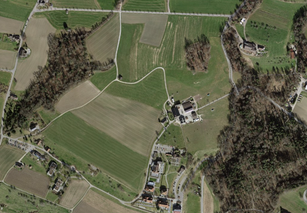

# Erkenntnisse der Vergleichsanalysen

Die Arealstatistik dient als Referenz für den Qualitätsvergleich der LULC-Datensätze. Die Klassifikationsmetriken zeigen deutliche Leistungsunterschiede:

- **Amtliche Vermessung**: geringste Übereinstimmung, tiefe Accuracy und schwacher F1-Score → insgesamt wenig verlässlich.
- **CORINE 2012/2018**: solide, ausgewogene Resultate mit guter Übereinstimmung; beide Versionen nahezu gleichwertig.
- **ESA WorldCover 2020/2021**: beste Gesamtleistung, besonders 2021; höchste Werte in allen Metriken → zuverlässigste Datensätze.

**Rangfolge:**

1. ESA WorldCover 2021
2. ESA WorldCover 2020
3. CORINE 2012 / 2018
4. Amtliche Vermessung

---

### Tabelle 6: Übersichtstabelle der Klassifikationsmetriken, Ergebnisse der besseren Methode

| Datensatz                              | Accuracy | Precision | Recall | F1-Score | Kappa  |
| -------------------------------------- | -------- | --------- | ------ | -------- | ------ |
| Amtlichen Vermessung                   | 0.5953   | 0.6511    | 0.5953 | 0.5361   | 0.5064 |
| CORINE Land Cover Vektordatensatz 2012 | 0.7533   | 0.7679    | 0.7533 | 0.7514   | 0.6819 |
| CORINE Land Cover Vektordatensatz 2018 | 0.7517   | 0.7685    | 0.7517 | 0.7504   | 0.6798 |
| ESA WorldCover 2020                    | 0.7854   | 0.8039    | 0.7854 | 0.7752   | 0.7089 |
| ESA WorldCover 2021                    | 0.8085   | 0.8218    | 0.8085 | 0.8016   | 0.7414 |

---

# Zentrale Ergebnisse der Vergleichsanalysen

CORINE 2018 und beide ESA-WorldCover-Datensätze zeigen eine gute Übereinstimmung mit der Arealstatistik.  
Über alle Datensätze hinweg stimmen besonders **Forestland** und **Settlements** am besten mit den IPCC-Kategorien überein.

### Tabelle 7: Übereinstimmung der IPCC-Kategorien in Prozent

| Datensatz                              | Forestland | Grassland | Cropland | Settlements | Wetlands | Other Land |
| -------------------------------------- | ---------- | --------- | -------- | ----------- | -------- | ---------- |
| Amtlichen Vermessung                   | 84%        | 10%       | 96%      | 50%         | 70%      | 67%        |
| CORINE Land Cover Vektordatensatz 2012 | 82%        | 56%       | 81%      | 61%         | 76%      | 90%        |
| CORINE Land Cover Vektordatensatz 2018 | 85%        | 58%       | 85%      | 64%         | 77%      | 91%        |
| ESA WorldCover 2020                    | 91%        | 80%       | 58%      | 45%         | 98%      | 79%        |
| ESA WorldCover 2021                    | 95%        | 83%       | 59%      | 44%         | 78%      | 83%        |
| Standardabweichung                     | 5.4%       | 29.2%     | 16.7%    | 9.2%        | 10.6%    | 9.8%       |

---

# Methodenvergleich

Die Methode **Cell Center** erzielt durchgehend die besseren Ergebnisse.  
Besonders bei der Amtlichen Vermessung ist der Vorteil gegenüber der **Max-Area-Methode** deutlich sichtbar.

### Tabelle 8: Cohen’s Kappa nach Datensatz und Methoden

| Datensatz                              | Methode     | Kappa  |
| -------------------------------------- | ----------- | ------ |
| Amtlichen Vermessung                   | Cell Center | 0.5064 |
|                                        | Max Area    | 0.4575 |
| CORINE Land Cover Vektordatensatz 2012 | Cell Center | 0.6819 |
|                                        | Max Area    | 0.6801 |
| CORINE Land Cover Vektordatensatz 2018 | Cell Center | 0.6798 |
|                                        | Max Area    | 0.6781 |
| ESA WorldCover 2020                    | Cell Center | 0.7089 |
|                                        | Max Area    | 0.6876 |
| ESA WorldCover 2021                    | Cell Center | 0.7414 |
|                                        | Max Area    | 0.7208 |

---

# Diskussion

Die Unterschiede zwischen den Datensätzen hängen stark von ihrer Erfassungsmethode ab:

- **Arealstatistik**: Luftbilder
- **CORINE und ESA**: Satellitenbilder
- **Amtliche Vermessung**: terrestrische Messungen und Zonenpläne

Dies führt z. B. bei **Cropland und Grassland** zu typischen Verwechslungen: Luftbilder zeigen viele Landwirtschaftsflächen im Aufnahmezeitpunkt grün, was zu Grassland-Zuordnungen führt.

Die Standardabweichungen aus Tabelle 7 sind bei CO₂-Analysen zu berücksichtigen.  
Eine spezifischere Klassenzuordnung könnte die Übereinstimmung verbessern.

Die **Cell-Center-Methode** liefert wie erwartet die besten Ergebnisse, da sie der Struktur moderner Raster-LULC-Daten entspricht.

---

  

**Abbildung 30**: Luftbild Region Zürichsee
