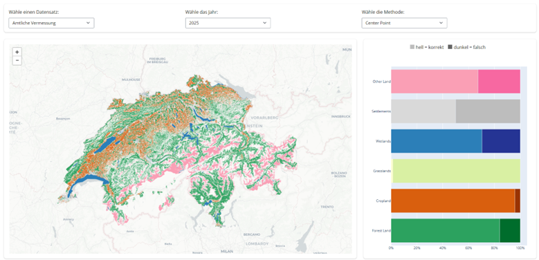

# Interaktive Visualisierung von LULC-Daten

Im experimentellen Teil des Projektes sollten analytische Legenden erstellt werden, um die Klassifizierungsgenauigkeit der Landnutzungskategorien transparent darzustellen. Erste Ansätze wurden bereits in Form von Visualisierungen umgesetzt. Dabei handelt es sich jedoch um statische Diagramme, die nebeneinander angeordnet sind und nur schwierig direkt miteinander in Beziehung gesetzt werden können. Aus diesem Grund wurde eine kleine interaktive serverseitige Webapplikation mit Shiny entwickelt. Das Ziel war es, die Vergleiche zwischen den verschiedenen Datensätzen mit der Arealstatistik visualisieren zu können. Konkret sollte ersichtlich sein, wie sich die einzelnen IPCC-Kategorien der Datensätze unterscheiden.

---

##	Vorgehen und Methodik
Um in der Webapplikation dynamisch die verschiedenen Analysen visualisieren zu können musste zuerst eine einheitliche Ordnerstruktur erstellt werden. Dazu wurden die Daten gemäss Tabelle 9 nach Jahr Methode und Datensatz unterteilt. 
| Datensatz        | Jahr | Methode     | Datei                                 |
|------------------|------|-------------|----------------------------------------|
| av               | 2025 | cell_center | AV-2025-AS-cell_center.gpkg           |
| av               | 2025 | max_area    | AV-2025-AS-max_area.gpkg              |
| corine_vector    | 2012 | cell_center | CORINEV-2012-AS-cell_center.gpkg      |
| corine_vector    | 2012 | max_area    | CORINEV-2012-AS-max_area.gpkg         |
| corine_vector    | 2018 | cell_center | CORINEV-2018-AS-cell_center.gpkg      |
| corine_vector    | 2018 | max_area    | CORINEV-2018-AS-max_area.gpkg         |
| corine_raster    | 2012 | cell_center | CORINER-2012-AS-cell_center.gpkg      |
| corine_raster    | 2018 | cell_center | CORINER-2018-AS-cell_center.gpkg      |
| worldcover       | 2020 | cell_center | WC-2020-AS-cell_center.gpkg           |
| worldcover       | 2020 | max_area    | WC-2020-AS-max_area.gpkg              |
| worldcover       | 2021 | cell_center | WC-2021-AS-cell_center.gpkg           |
| worldcover       | 2021 | max_area    | WC-2021-AS-max_area.gpkg              |

**Tabelle 9**: Datensätze der Vergleichsanalysen mit der Arealstatistik

Die zuvor durchgeführten Vergleichsanalysen mit der Arealstatistik führten jeweils zu einem Geopackage, das ein flächendeckendes 100m Gitter über die gesamte Schweiz sowie zugehörige Attributtabellen enthält. Diese Attribute beschreiben die Unterschiede zwischen den Datensätzen und ermöglichen eine detaillierte Auswertung der Abweichungen auf Zellenebene. Für interaktive Anwendungen wie Shiny sind solche Vektorgitter jedoch zu wenig performant. Um die Interaktivität sicherzustellen, wurden die Geopcakages daher in Sammlungen von Rasterdaten überführt. Für jede der sechs IPCC-Kategorien wurde ein eigenes Raster im Format GeoTIFF erzeugt. Jede Rasterzelle entspricht exakt dem Mittelpunkt einer Vektorfläche des ursprünglichen 100m Gitters. Der Rasterwert kodiert dabei:
•	1: korrekte Klassifizierung
•	0: Abweichung zur Arealstatistik
•	255: keine Daten verfügbar
Zusätzlich zur Rastererstellung musste auch eine kompakte Statistikdatei erzeugt werden. Dafür wurden die Gitterzellen nach IPCC-Kategorie gruppiert und für jede Kategorie die Anzahl korrekt bzw. falsch klassifizierter Zellen sowie deren Anteil berechnet. Die Ergebnisse werden als CSV gespeichert und dienen in Shiny als Grundlage für das Balkendiagramm.  
Zur Reproduzierbarkeit wurde ein Python-Skript entwickelt, das für alle Datensätze automatisch die Raster- und Statistikdateien im gleichen Ordner wie das Geopackage erstellt.
Für die Webapplikation wurde in Shiny zunächst die Benutzeroberfläche erstellt, welche aus einer Leiste zur Auswahl des Datensatzes, einer Karte und einem Balkendiagramm besteht. Über die Auswahlfelder können Nutzer den gewünschten Datensatz, das Jahr und die angewendete Klassifizierungsmethode auswählen. Die Auswahl des Jahres und der Methode werden dynamisch an den gewünschten Datensatz angepasst. Bei einer Auswahl werden die neue Karte und das Diagramm reaktiv gerendert. 

  

**Abbildung 31** Screenshot der Shiny App

Die Karte und das Diagramm in Abbildung 31 wurden angelehnt an die bereits vorhandene Visualisierung aus Abbildung 13 erstellt. Zur Darstellung der Rasterdaten auf der Karte wurde eine Funktion implementiert, die GeoTIFF-Dateien in transparente PNG-Bilder umwandelt, die anschliessend als Overlays in der Leaflet-Karte dargestellt werden. Die Funktion liest dabei die Rasterwerte aus, weist jeder Zelle eine Farbe zu und setzt die Transparenz für fehlende Daten. Korrekt klassifizierte Zellen werden hell und falsch klassifizierte Zellen dunkel eingefärbt, entsprechend den definierten Farben für jede IPCC-Kategorie. Durch das Hochskalieren der Rasterbilder wird sichergestellt, dass die Overlays auch bei hoher Zoomstufe eine scharfe Darstellung behalten. Abschliessend werden die Bilder als PNGs eingebettet und auf die geografischen Ausdehnungen des ursprünglichen Rasters ausgerichtet, sodass die Visualisierung genau auf der Karte positioniert wird. Dieses Vorgehen erlaubt eine performante Darstellung der Rasterdaten. 
Das Balkendiagramm wird auch dynamisch erzeugt, indem zunächst die vom Anwender ausgewählten Parameter (Datensatz, Jahr und Methode) aus den Eingabefeldern ausgelesen werden. Anhand dieser Auswahl wird die entsprechende CSV-Datei geladen, die statistische Informationen zu den IPCC-Kategorien enthält, insbesondere die Anteile korrekt und falsch klassifizierter Flächen. Mit dem Python-Bibliothek Plotly wird daraus ein horizontales Balkendiagramm erstellt, bei dem die y-Achse die IPCC-Kategorien und die x-Achse die Anteile in Prozent darstellt. Die Balken sind gestapelt und farblich kodiert. Korrekt klassifizierte Flächen erscheinen hell, falsch klassifizierte Flächen dunkel. Über die Achsen- und Layouteinstellungen wird die Darstellung ansprechend formatiert, z.B. mit Prozentangaben auf der x-Achse und sortierten Kategorien. Um Interaktivität zu gewährleisten, wurde eine Klickfunktion auf das Balkendiagramm implementiert. Durch das Anklicken eines Balkens wird das entsprechende Raster entweder geladen oder von der Karte entfernt. 

---
 
##	Ergebnisse der interaktiven Visualisierung
Mit nur einem Python-Skript konnte in Shiny eine komplette Webapplikation mit Frontend, Backend und Reaktivität erstellt werden. Die Shiny Webapplikation aus Abbildung 31) erlaubt es, die Genauigkeit der Landnutzungsklassifizierung interaktiv zu analysieren. Nutzer wählen Datensatz, Jahr und Methode aus und sehen sofort auf einer Karte, welche Flächen übereinstimmend klassifiziert wurden. Parallel zeigt ein Balkendiagramm die Anteile je Kategorie. Durch Anklicken der Balken lassen sich einzelne Kategorien gezielt ein- oder ausblenden. So können Unterschiede zwischen Datensätzen schnell erkannt und räumlich nachvollzogen werden, was die Analyse und Interpretation der Daten deutlich erleichtert. Im Gegensatz zu einer statischen Visualisierung ist hier ein direkter Zoom in die Karte möglich, um detailliert Bereiche inspizieren zu können. Das ist hier besonders wichtig, weil jeder Pixel der Karte eine klare Bedeutung hat.

---

##	Diskussion der Ergebnisse
Die interaktive Shiny Webapplikation erlaubt es, die Klassifizierungsgenauigkeit der Landnutzungskategorien sehr anschaulich zu analysieren. Durch die Kombination aus Karte und Balkendiagramm können sowohl statistische als auch räumliche Unterschiede zwischen Datensätzen direkt erkannt werden. Aufgrund des Verwendens von Rasterdaten ist die Ladezeit der Datensätze besser als erwartet bei ungefähr zehn Sekunden.
Die App schafft nicht nur eine interaktive analytische Legende, sondern vereint auch die Ergebnisse der verschiedenen Analysen in einem einheitlichen Endprodukt. Ausserdem wurden beim Erstellen der App viele Schwachstellen des Gesamtprojektes behoben, wie z.B. eine einheitliche Ordnerstruktur, einheitliche Name, eine Tabelle aller Analyseergebnisse und die Rasterisierung der Vektordaten. Mit der App ist es zum ersten Mal möglich explorativ die Ergebnisse aller Visualisierungen an einem Ort zu betrachten. Ausserdem ist die App als modulares Dashboard aufgebaut und ist somit beliebig erweiterbar. Für zukünftige Erweiterungen der App gibt es mehrere Ansätze, um die Analyse weiter zu verbessern. So könnten z.B. ab einer gewissen Zoomstufe Vektor- statt Rasterdaten dargestellt werden. Diese könnten dann im Gegensatz zu den Rasterdaten auch interaktive verwendet werden. Man könnte z.B. bei einem Klick auf die einzelnen Pixel die zugehörige Übergangsmatrix wie in Kapitel 4.3 visualisieren. Neben der Übergansmatrix könnten natürlich auch aggregierte Karten wie in Kapitel 4.2 dargestellt werden. Da aus zeitlichen Gründen vor allem die Funktionalität im Vordergrund stand würde in einem weiteren Schritt die Benutzefreundlichkeit und das Design noch überarbeitet werden. Dazu könnten Hilfetexte und ein klareres Farblayout erstellt werden. Es könnten auch noch weitere Datensätze dazu genommen werden wie z.B. der zeitliche Vergleich.

[↑](#top)

  

    <a href="10_prognose_modellierung.html">← Prognose und Vorhersage der LULC-Daten</a>
  

  

    <a href="12_schlussfolgerung.html">Schlussfolgerung →</a>
  

